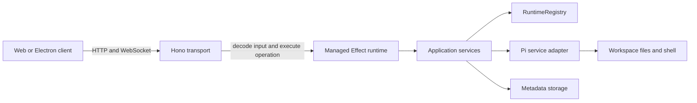

# Effect Hono API Plan

## Status

Proposed

## Objective

Build the standalone API as a Hono transport layer over an Effect application runtime. Hono owns HTTP and WebSocket concerns; Effect owns application services, resource lifecycles, concurrency, typed failures, and integration with the Pi SDK.

The design must keep agent runs alive independently of any client connection and make the server straightforward to test with substitute Pi, filesystem, persistence, and authentication services.

## Current repository baseline

`apps/api` is still the original Hono scaffold: it serves `GET /` on port `3000`, constructs the app and listener in one file, and currently declares only Hono, `@hono/node-server`, and Effect. It does not yet satisfy the foundation acceptance criteria. Phase 1 must replace that entry point, update `apps/api/README.md`, add the pinned platform/Pi and WebSocket dependencies, create `packages/protocol`, and add the Vite proxy; the existing scaffold is not evidence that the planned lifecycle is already implemented.

## Goals

- Run Hono and the Effect runtime in one independently executable Node.js process.
- Create one managed Effect runtime for the lifetime of the server.
- Model expected application failures as typed errors.
- Manage Pi sessions, background work, subscriptions, and shutdown as scoped resources.
- Keep Hono handlers thin and transport-specific.
- Keep Pi SDK types and behavior behind a server-only adapter.
- Share a versioned, runtime-validated application protocol with clients.
- Support deterministic tests without opening network ports or invoking a real model.

## Non-goals

- Replacing Hono with an Effect HTTP server.
- Expressing routing or basic response construction through unnecessary Effect abstractions.
- Exposing Effect, Hono, or Pi SDK implementation details in the wire protocol.
- Creating an Effect runtime or rebuilding application layers for every request.
- Coupling an agent run to the lifetime of an HTTP request or WebSocket connection.

## Architectural boundary



A request follows this path:

1. Hono accepts an HTTP request or WebSocket message.
2. The transport boundary authenticates the client and decodes the protocol input.
3. The handler executes one application Effect using the process-wide managed runtime.
4. The application service performs the operation or starts supervised background work.
5. The handler maps typed success or failure values to the versioned protocol.
6. Unexpected defects are logged with their full cause and returned as an opaque internal error.

The transport may disappear after step 4. Agent execution remains owned by the runtime registry until completion, explicit abort, session closure, or server shutdown.

## Dependency strategy

Pin the selected integration packages used by the API:

- `effect` `4.0.0-beta.107`;
- `@effect/platform-node` `4.0.0-beta.107`;
- `@effect/vitest` `4.0.0-beta.107` when Effect-aware test helpers are introduced;
- `@earendil-works/pi-coding-agent` `0.84.2`; and
- `@hono/node-ws` for Hono's Node WebSocket upgrade adapter, pinned to the version selected by the lockfile.

Do not use caret ranges for beta packages or mix examples from other Effect release lines. All implementation work must use the installed package's `ai-docs` and the matching `effect@4.0.0-beta.107` source.

Use Effect Schema for protocol discriminated unions and runtime decoding. `Schema.toStandardSchemaV1()` can adapt schemas at Standard Schema boundaries. Keep schemas free of server services and Pi types, and verify the tree-shaken browser production bundle before completing the protocol phase. If the bundle impact is unacceptable, preserve the same public shapes behind a smaller Standard Schema implementation.

## Effect 4 idiomatic design audit

The plan is consistent with the selected Effect source when implemented with these concrete APIs and constraints:

- define dependencies with `Context.Service` and construct live/test implementations with `Layer.sync`, `Layer.effect`, and scoped acquisition;
- use `Config` recipes backed by Schema for environment decoding rather than parsing `process.env` throughout services;
- define serializable expected failures with `Schema.TaggedError`;
- create one `ManagedRuntime` with `ManagedRuntime.make(AppLive)` for repeated Hono callback execution, force its context before listening so lazy layer failures happen during startup, and dispose it exactly once;
- run the process entry effect with `NodeRuntime.runMain()` for Node signal interruption and exit-code handling;
- use `ManagedRuntime.runPromiseExit()` at Hono boundaries so typed failures and defects remain distinguishable through `Exit` and `Cause`;
- wrap Pi and Node promises with `Effect.tryPromise`, forwarding its interruption `AbortSignal` whenever the underlying API supports cancellation;
- acquire Pi runtimes and subscriptions with `Effect.acquireRelease` or scoped finalizers;
- use `Queue` plus one consumer fiber for serialized commands and callback event ingress;
- use a scoped `FiberMap` for keyed background operations so scope closure interrupts all work;
- use `Ref` or `SynchronizedRef` for snapshots, sequence allocation, and replay state;
- use a sliding `PubSub` for live fan-out so slow subscribers cannot backpressure Pi; and
- keep active sessions in explicitly retained child scopes. Do not acquire a keyed session layer only for one request, because releasing that request scope could finalize an accepted run.

Do not use Effect's unstable HTTP stack alongside Hono. Effect is the application runtime and Hono remains the transport.

## Process lifecycle

The server entry point owns startup and shutdown:

1. Define validated configuration with Effect `Config` and Schema.
2. Construct the closed `AppLive` layer.
3. Create one `ManagedRuntime` from that layer and force `runtime.context()` before listening.
4. Construct the Hono app with a narrow executor backed by `runPromiseExit()`.
5. Create the Hono app shell, call `createNodeWebSocket({ app })`, register the WebSocket route with its `upgradeWebSocket` helper, acquire the Node server as a scoped resource on `127.0.0.1:31415` by default, and call `injectWebSocket(server)` exactly once.
6. Run the main scoped effect through `NodeRuntime.runMain()`.
7. On `SIGINT` or `SIGTERM`, interrupt the scoped main effect. First stop accepting HTTP/upgrades, then close WebSockets with a restart/shutdown close code, and allow only a bounded transport drain.
8. Dispose the managed runtime; its layer finalizers close registry-owned session scopes, interrupt FiberMaps, flush settings, and release Pi resources.

Startup failure must terminate with a non-zero status before the server accepts traffic. Shutdown should have a bounded grace period and log any resources that fail to finalize. Runtime disposal is idempotently guarded so competing shutdown paths cannot dispose it twice.

## Static services and dynamic resources

Effect layers should construct process-wide services. Dynamically opened sessions belong inside the runtime registry rather than becoming one layer per session.

### Initial process-wide services

#### ServerConfig

Owns validated server configuration, including:

- bind host and port;
- data directory;
- allowed workspace roots;
- log level;
- authentication mode; and
- shutdown grace period.

The default bind host is `127.0.0.1`. Listening on a non-loopback address requires explicit configuration.

#### RuntimeRegistry

Owns the active workspace and session controllers. It is responsible for:

- locating or opening a session;
- guaranteeing one controller per active session identifier;
- supervising session resources and background work;
- aborting and closing sessions;
- exposing snapshots and event subscriptions; and
- closing all controllers during shutdown.

#### Pi SDK adapter services

Only adapter modules import the Pi SDK. Split the boundary into focused services rather than one implementation object:

- `PiModelRuntime` owns the process-global model, provider, and credential runtime;
- `PiRuntimeFactory` creates cwd-bound `AgentSessionRuntime` resources;
- `PiProjection` converts Pi messages, events, models, tools, and diagnostics into server-owned values; and
- `ApprovalBroker` bridges the server-owned approval extension to authenticated clients.

The adapter covers session creation/replacement, prompts and queues, model/thinking controls, tools, compaction/retry, direct bash, settings, resources, credentials, session trees, exports, and extension UI. Raw Pi SDK values must not cross this boundary into Hono routes or `packages/protocol`.

The complete mapping is defined in [Pi SDK Integration Plan](./pi-sdk-integration.md).

#### WorkspaceService

Canonicalizes workspace paths, enforces allowed roots and trust rules, and provides controlled workspace metadata. Filesystem and shell capabilities remain server-side.

#### MetadataStore

Persists Oh My ADE-specific settings and trusted workspace metadata under the application data directory. Pi remains the source of truth for conversation persistence.

Authentication, pairing, approval policy, and credential services should be added as process-wide services when their delivery phases begin.

## Session controller model

Each active session controller owns an explicitly retained child scope containing:

- the Pi `AgentSessionRuntime` resource;
- a serialized command queue and worker;
- a lossless event-ingress queue and one event-pump fiber;
- the current application snapshot in a `Ref` or `SynchronizedRef`;
- a monotonically increasing event sequence counter;
- a bounded replay buffer;
- a sliding `PubSub` for connected clients; and
- a scoped `FiberMap` for active agent, compaction, and direct-bash work.

### Command semantics

- Mutating commands are serialized per session.
- Commands for different sessions may execute concurrently.
- Starting a prompt returns control after the run has been accepted; the run continues in a registry-owned fiber. Starting another fiber under the same `FiberMap` key would interrupt the existing fiber, so prompt startup uses `onlyIfMissing` (or an equivalent explicit conflict check) and steering/follow-up do not replace the active run fiber.
- Every mutation has a client command ID. The controller retains a bounded, server-incarnation-local command-result cache so retransmission after reconnect returns the original acceptance/result rather than repeating the mutation. After process restart, clients reconcile a snapshot and do not automatically retry an ambiguous mutation.
- Abort targets the active run and is safe to request more than once.
- A client disconnect removes only that client's subscription.
- Closing a session interrupts its work and runs all session finalizers.
- Server shutdown closes all session scopes.

### Event semantics

Every published server event includes:

- protocol version;
- workspace and session identifiers;
- monotonically increasing session sequence number;
- event type; and
- validated event payload.

A reconnecting client supplies its server incarnation ID, controller ID, and last sequence number. Subscription establishment and replay/snapshot capture happen as one controller operation: live publication is attached before the replay boundary is finalized, so no event can be lost between catch-up and live delivery. A stream-identity mismatch or unavailable complete gap produces a fresh snapshot and replay position.

Slow clients must not block an agent run or other clients. The sliding PubSub may evict old live events; sequence-gap detection then uses the independent replay ring or a fresh snapshot. Each WebSocket also has bounded inbound and outbound queues, message-size/rate limits, and is closed when it repeatedly fails to catch up. Hono's Node WebSocket callbacks do not await returned promises, so `onMessage` must explicitly enqueue work or start a supervised task and attach failure handling; no rejected callback promise may be left unobserved.

The synchronous Pi callback copies the minimal immutable fields needed for projection and performs only `Queue.offerUnsafe()` into the ingress queue. It must check the boolean result so offers after scope closure are visible in diagnostics. The event pump serializes projection, snapshot updates, sequence allocation, replay insertion, and publication. Do not retain mutable Pi message/tool objects for deferred processing.

## Error model

Expected failures should be tagged application errors, grouped by responsibility rather than by transport status. Initial categories include:

- `InvalidRequest`;
- `Unauthorized` and `Forbidden`;
- `WorkspaceNotAllowed`;
- `SessionNotFound` and `SessionConflict`;
- `PiUnavailable` and `PiOperationFailed`;
- `PersistenceFailed`; and
- `ServerShuttingDown`.

The Hono boundary maps these errors to stable protocol error codes and HTTP statuses or WebSocket error events. Every command response echoes its command ID. Error payloads may include safe user-facing context but must not expose credentials, filesystem details outside trusted workspaces, stack traces, or raw provider responses.

Unexpected defects are not converted into ordinary domain errors deep in the application. They reach the boundary as causes, are logged for diagnosis, and produce a generic internal-error response with a request identifier.

## Hono transport design

Separate app construction from process startup so tests can invoke `app.request()` without opening a socket.

Planned API structure:

```text
apps/api/src/
├── index.ts                     # Process entry point
├── app.ts                       # Hono app construction
├── config.ts                    # Bootstrap configuration
├── runtime.ts                   # Live layer and managed runtime
├── http/
│   ├── errors.ts                # Application error to HTTP mapping
│   ├── middleware.ts            # Request ID, logging, security, auth
│   └── routes/
│       ├── health.ts
│       ├── workspaces.ts
│       ├── sessions.ts
│       ├── attachments.ts
│       ├── downloads.ts
│       └── websocket.ts
├── services/
│   ├── pi/
│   │   ├── model-runtime.ts
│   │   ├── runtime-factory.ts
│   │   ├── projection.ts
│   │   └── approval-broker.ts
│   ├── runtime-registry.ts
│   ├── workspace-service.ts
│   └── metadata-store.ts
└── session/
    ├── session-controller.ts
    ├── session-state.ts
    └── session-events.ts
```

Route modules should use Hono's `app.route()` composition and preserve Hono's route inference. Avoid controller classes. The protocol package, rather than exported Hono RPC types, is the stable client contract because WebSocket commands and events must share the same versioned model.

Initial routes:

- `GET /api/v1/health` for process readiness and protocol version;
- resource routes under `/api/v1`, including authenticated, size-limited attachment upload and controlled export/download routes; and
- one authenticated WebSocket upgrade endpoint under `/api/v1/ws`.

Use `@hono/node-ws` with `@hono/node-server`; construct the adapter from the Hono app before registering the WebSocket route, and have process startup call `injectWebSocket(server)`. Authentication and `Origin` checks run before upgrade. Browser clients authenticate with a secure cookie or exchange credentials over HTTP for a short-lived, single-use WebSocket ticket; long-lived tokens do not go in WebSocket query strings.

The health route should distinguish basic process liveness from readiness when startup later depends on storage or Pi initialization. Production SPA fallback is registered after `/api/v1` routes and must never turn an unknown API route into `index.html`.

## Protocol package

Create `packages/protocol` before exposing agent operations. It owns:

- protocol version constants;
- branded or validated identifiers;
- HTTP request and response schemas;
- WebSocket hello/resume messages containing protocol version and stream identity;
- WebSocket client command unions with command IDs and optional expected revisions;
- WebSocket command-result and server-event unions;
- snapshots, replay messages, server incarnation IDs, controller IDs, and sequence positions;
- opaque attachment/export references that never expose unrestricted host paths; and
- stable public error codes.

The package must be safe to import from Node, browsers, and the Electron renderer. It must not import the Pi SDK, Node-only modules, server services, or secrets.

## Observability

Use structured logging at the application boundary and around long-running operations. Include:

- request ID;
- workspace and session IDs where safe;
- run ID;
- operation name;
- duration and outcome; and
- structured Effect cause information for failures.

Do not log prompt content, model credentials, pairing secrets, or raw tool input by default. Detailed diagnostic logging must be explicit and redact known secrets.

Initial metrics can remain log-derived, but service boundaries should make it possible to add counters and traces without changing protocol handlers.

## Testing strategy

### Unit tests

- Configuration decoding and unsafe bind-address protection.
- Protocol schema round trips and rejection cases.
- Error-to-protocol mapping.
- Session state transitions and replay-buffer behavior.
- Workspace path canonicalization, symlink escape prevention, nonexistent-target parent checks, and allowlist enforcement.

### Service tests

Build test layers with in-memory implementations for Pi and persistence. Verify:

- commands are serialized within a session;
- separate sessions can run concurrently;
- disconnecting a subscriber does not interrupt a run;
- abort interrupts the active operation;
- closing a controller runs finalizers;
- replay/subscription handoff cannot lose an event and falls back to a snapshot on stream-identity mismatch;
- duplicate command IDs within one server incarnation do not repeat mutations, and clients do not automatically retry ambiguous mutations across an incarnation change;
- a second prompt cannot replace/interrupt the active run fiber; and
- shutdown closes every active controller.

Use `@effect/vitest`, Effect test services, controllable clocks, Deferreds, and deterministic synchronization instead of sleeps. Keep Hono-only tests as ordinary Vitest tests when Effect-specific helpers add no value.

### Transport tests

Construct the Hono app with a test runtime and use `app.request()` for:

- health responses;
- validated failures;
- authentication and authorization;
- not-found and internal-error payloads; and
- request identifier propagation.

Add Node-level integration tests for WebSocket upgrade, reconnect, and graceful shutdown behavior.

## Delivery phases

### Phase 1: Foundation

- Pin Effect and platform packages to exactly `4.0.0-beta.107`.
- Create `packages/protocol` with the version and base response schemas.
- Split Hono app construction from process startup.
- Add validated configuration and safe bind defaults.
- Construct one managed runtime and live application layer.
- Add request IDs, structured logging, secure headers, Origin policy, and error mapping.
- Integrate `@hono/node-ws` with an injectable upgrade helper and explicit server injection.
- Add `GET /api/v1/health` and foundation tests.
- Update `apps/api/README.md` and all development URLs to port `31415`.
- Configure Vite to proxy API and WebSocket traffic to port `31415`.

### Phase 2: One persistent Pi session

- Implement the Pi adapter against `@earendil-works/pi-coding-agent` `0.84.2` following the dedicated integration plan.
- Implement the first scoped session controller and runtime registry.
- Support text prompt, streaming events, snapshot retrieval, and abort; add bounded attachment upload before enabling image prompts.
- Keep the run alive across client disconnects.
- Test with a deterministic fake Pi service before live integration tests.

### Phase 3: Multi-session resources

- Add workspace discovery and allowlisting.
- Add session listing, creation, restoration, rename, and close operations.
- Add model and thinking-level controls.
- Persist application metadata separately from Pi conversations.

### Phase 4: Reliable streaming

- Add server incarnation/controller stream identities, sequence numbers, and bounded replay buffers.
- Add atomic reconnect/subscription negotiation and snapshot fallback.
- Add command-result deduplication and expected-revision rules.
- Define slow-subscriber and outbound WebSocket overflow behavior.
- Add steering, follow-up, and compaction commands.

### Phase 5: Approval and security

- Add tool approval policy and request/response flows.
- Add client authentication and pairing.
- Protect both HTTP and WebSocket handshakes.
- Add remote-bind safeguards and security-focused integration tests.

### Phase 6: Production serving and operations

- Serve the compiled React application from Hono.
- Harden graceful shutdown and startup recovery.
- Add production logging, diagnostics, and packaging.
- Validate standalone, remote private-host, and Electron-launched deployment modes.

## Acceptance criteria for the foundation phase

- The server binds to `127.0.0.1:31415` by default.
- Invalid configuration fails before accepting requests.
- Exactly one managed Effect runtime is created per server process.
- Hono app tests run without binding a port.
- `GET /api/v1/health` returns a versioned, runtime-validated response.
- Expected application failures map to stable public errors.
- Unexpected defects produce an opaque response and structured server log.
- `SIGINT` and `SIGTERM` stop intake and dispose application resources.
- The web development server proxies HTTP and future WebSocket traffic to Hono.
- Typecheck, test, and production build commands pass.

## Key decisions

- Hono remains the HTTP and WebSocket transport.
- Effect owns application composition, typed failures, concurrency, and resource safety.
- One managed Effect runtime lives for the server process lifetime.
- Process-wide services are layers; active sessions are dynamic scoped resources in the runtime registry.
- Agent runs belong to the server and outlive client connections.
- Pi SDK integration is isolated behind focused adapter services and follows [Pi SDK Integration Plan](./pi-sdk-integration.md).
- Effect and platform beta dependencies are pinned exactly to `4.0.0-beta.107`.
- The shared protocol is versioned and runtime validated, with no Pi or server implementation types.
