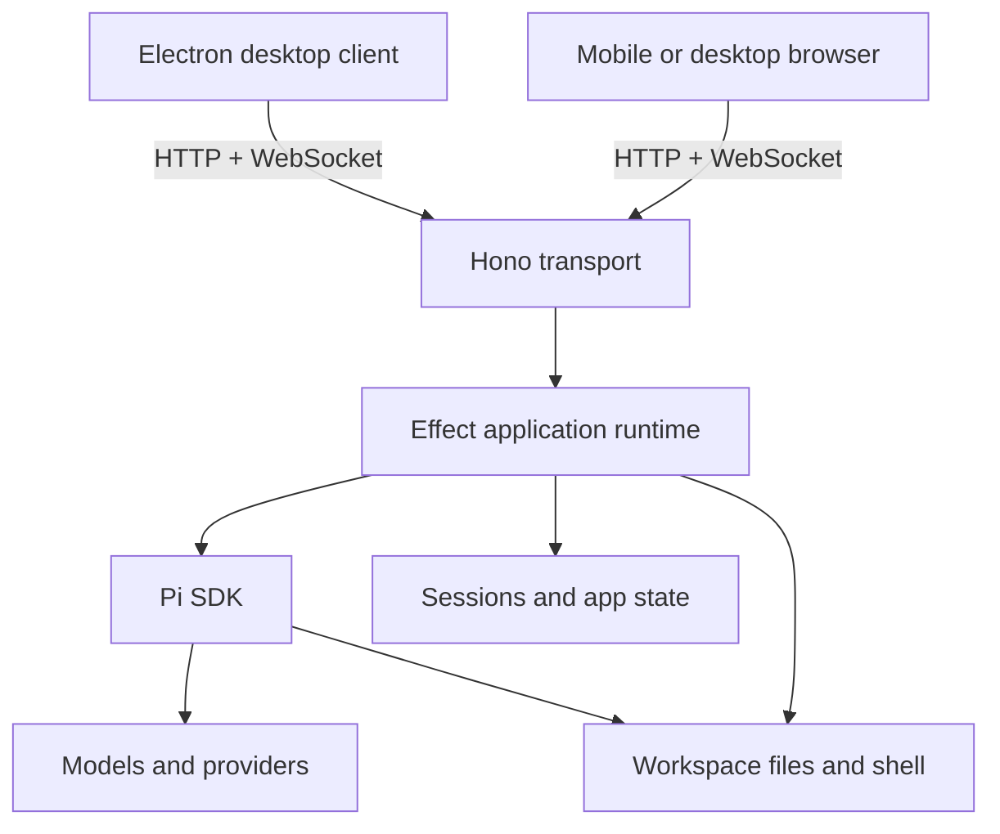
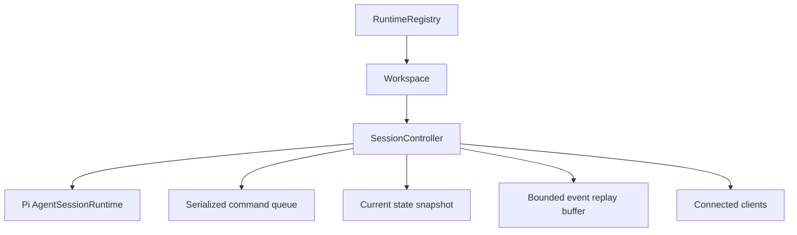

# Oh My ADE Architecture Plan

## Status

Draft

## Objective

Build Oh My ADE (Agentic Development Environment) as an interface for the Pi coding agent that is available as both:

- a responsive web application for desktop and mobile browsers; and
- an Electron desktop application with native operating-system integrations.

The backend must run independently of Electron so that browser clients can use the application whenever the backend host is running.

## High-level architecture



The standalone API process uses Hono as its HTTP and WebSocket transport and Effect as its application runtime. The Effect application core owns services, typed failures, concurrency, and resource lifecycles; only its Pi service adapter communicates directly with the Pi SDK. The Electron and browser applications are clients of the same API and share the same React UI.

## Repository layout

Use a bun workspace so all applications and shared packages can be developed together while remaining independently buildable.

```text
ohmyade/
├── apps/
│   ├── api/                 # Standalone Hono and Pi server
│   ├── web/                 # Shared React and Vite application
│   └── desktop/             # Thin Electron main and preload processes
├── packages/
│   ├── protocol/            # Shared API commands, events, and schemas
│   ├── domain/              # Shared application types
│   └── ui/                  # Shared UI components when needed
├── docs/
│   └── plans/
└── package.json
```

The Electron application should load the UI from `apps/web`; it should not have a separate renderer implementation. `packages/protocol` is the only stable wire-contract package. `packages/domain` may contain Pi-free values genuinely shared outside the transport, but server-only domain/service types stay in `apps/api`; protocol schemas must not re-export internal domain objects. Create `packages/ui` only when more than one renderer build actually needs extracted components.

## Components

### Hono and Effect API

The API runs as an independent Node.js process. Hono owns routing, middleware, HTTP responses, and WebSocket upgrades. Thin transport handlers decode the shared protocol, execute application operations using one process-wide managed Effect runtime, and map typed failures back to protocol responses.

Effect owns application service composition, configuration, concurrency, background work, and scoped resource cleanup. Process-wide dependencies are provided as layers, while active Pi sessions are dynamic scoped resources supervised by the runtime registry. The server creates one managed Effect runtime at startup and disposes it during graceful shutdown; it must not create a new runtime for each request.

The API process owns:

- Pi SDK integration;
- workspace and project access;
- model and provider configuration;
- agent and session lifecycles;
- filesystem and shell access;
- tool approval policies;
- client authentication;
- persistent application settings; and
- streaming agent events to connected clients.

Agent execution belongs to a registry-owned Effect scope and supervised fiber rather than a client connection. Closing Electron, refreshing a browser, or temporarily losing a connection must not terminate an active agent run. The Pi SDK is isolated behind a server-only service adapter, and Pi SDK types do not cross into Hono routes or the shared protocol.

The detailed backend design and delivery sequence are defined in [Effect Hono API Plan](./api/api-effect.md). The exhaustive Pi boundary, lifecycle, and capability mapping is defined in [Pi SDK Integration Plan](./api/pi-sdk-integration.md).

### React web application

The responsive React/Vite application owns:

- conversation and tool-output rendering;
- prompt composition;
- session and workspace navigation;
- model and thinking-level controls;
- approval dialogs;
- connection and reconnection state; and
- layouts suitable for desktop and mobile screens.

The production Hono server should serve the compiled web application. During development, Vite runs separately and proxies API and WebSocket traffic to Hono.

### Electron application

Electron is an optional native client. It uses the same React application and API as the browser client while adding:

- native windows and menus;
- system tray support;
- desktop notifications;
- secure storage for server credentials;
- launch-on-login and server discovery;
- deep links and global shortcuts; and
- integrations such as opening a file in an editor or terminal.

Electron may offer to launch the standalone server as a convenience, but the server must remain independently executable. Native actions are explicit renderer-to-preload IPC capabilities with context isolation and a narrow allowlist; they are not generic shell or filesystem bridges. When the API host is remote, the UI must distinguish files on the server host from paths on the Electron client and disable local-only actions that cannot be resolved safely.

## Communication

Use HTTP for resource-oriented operations such as:

- listing and opening workspaces;
- listing, creating, and renaming sessions;
- loading models and settings;
- uploading bounded, authenticated attachments and downloading controlled exports; and
- obtaining the initial state snapshot.

Use WebSocket for interactive, bidirectional communication such as:

- prompts, steering messages, and follow-ups;
- streaming assistant text and thinking;
- tool execution updates;
- abort and compaction requests;
- approval requests and responses; and
- agent lifecycle events.

Define the protocol as versioned discriminated unions with runtime validation in `packages/protocol`. Effect Schema is the preferred implementation if its browser bundle impact is acceptable; the protocol remains schema-library-independent at its public boundary. Client code must depend on this application protocol rather than Pi SDK types.

Every command carries a client-generated command ID used for response correlation and bounded deduplication within one server incarnation. This prevents a reconnecting client from accidentally applying the same mutation twice when command acceptance was sent but not received. After a server-incarnation change, a client must fetch a snapshot and surface an ambiguous prior command instead of automatically retransmitting it; exactly-once execution cannot be inferred across a crash without transactional coordination with Pi persistence. Commands that intentionally conflict with concurrent clients also carry an expected revision or use an explicitly documented last-writer-wins rule.

Every streamed server event has a monotonically increasing sequence number within a stable stream identity composed of a server incarnation ID and controller ID. The WebSocket handshake supplies the protocol version, stream identity, and last received sequence. The server atomically establishes the subscription and returns either the complete missed-event range or a snapshot plus replay position; this avoids a gap between snapshot/replay retrieval and live subscription. A changed server incarnation or controller identity always requires a fresh snapshot.

## Session model

The server maintains a runtime registry organized by workspace and session:



Each session controller owns a scope containing its Pi resource, serialized command queue, current snapshot, sequence counter, bounded replay buffer, client publication mechanism, and supervised agent work. Mutating commands are serialized within a session, while separate sessions may execute concurrently. Disconnecting a client removes only its subscription; closing a session or shutting down the server interrupts its work and runs its finalizers.

A controller has a stable Oh My ADE controller ID and a replaceable Pi session ID/file/cwd. Registry indexes are updated only after a successful Pi replacement and are removed or marked unavailable if Pi tears down the old runtime but fails to create its replacement. Sequence numbers remain controller-local across successful replacement; a newly created controller gets a new stream identity.

Pi remains the source of truth for conversation persistence. Application-specific settings and trusted workspace metadata are stored separately under an Oh My ADE data directory.

## Deployment modes

### Development

One root command starts Hono, Vite, and Electron concurrently:

```text
Hono API: http://localhost:31415
Vite UI:  http://localhost:5173
Electron: loads the Vite UI
```

### Standalone web

The Hono process serves both the production React build and the API. Desktop and mobile browsers connect to the same address. The host must remain running because Pi and the workspaces live there.

### Desktop

Electron connects to a configured Hono server. This may be a server on the same machine or a remote private host. Electron can optionally start the standalone local server executable.

## Security baseline

- Bind to `127.0.0.1` by default.
- Require explicit configuration before accepting remote connections.
- Authenticate HTTP and WebSocket clients and authorize each workspace/session operation.
- For browser WebSockets, use a secure cookie or short-lived single-use WebSocket ticket because the browser WebSocket API cannot set an arbitrary authorization header; validate `Origin` on HTTP and upgrade requests.
- Protect cookie-authenticated mutations against CSRF and never place long-lived bearer credentials in URLs.
- Pair new devices using a short-lived code or QR flow.
- Canonicalize and allowlist workspace paths on the server.
- Keep model credentials out of browser and Electron renderer processes.
- Default unattended tool approvals to deny.
- Treat Pi project trust as resource loading protection, not as a sandbox.
- Require TLS whenever traffic can leave loopback; recommend a private network or VPN rather than exposing the service directly to the public internet.

## Initial delivery phases

1. Scaffold the bun workspace and shared protocol package.
2. Establish the Hono transport and managed Effect runtime, including validated configuration, lifecycle handling, typed error mapping, and a health endpoint.
3. Integrate one persistent, scoped Pi session with prompt, stream, and abort support.
4. Build the responsive React conversation interface.
5. Add workspace, session, model, and approval management through Effect application services.
6. Add reconnection snapshots, sequence numbers, bounded event replay, and slow-client handling.
7. Package the shared UI in a thin Electron client.
8. Add authenticated private-network access and mobile/PWA polish.

## Key decisions

- The independent Node.js API uses Hono as its transport and Effect `4.0.0-beta.107` as its application runtime.
- One managed Effect runtime lives for the server process lifetime; active sessions are dynamic scoped resources.
- The Pi SDK is isolated behind a server-only service adapter and is never imported by client applications.
- React/Vite provides one shared responsive UI.
- Electron is a thin optional native client, not the server owner.
- HTTP handles resources and WebSocket handles live agent interaction.
- Pi owns conversation persistence; Oh My ADE owns only application-specific metadata.
