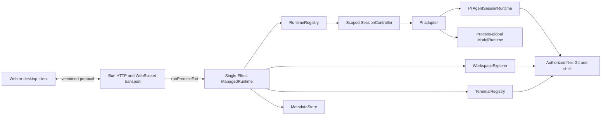
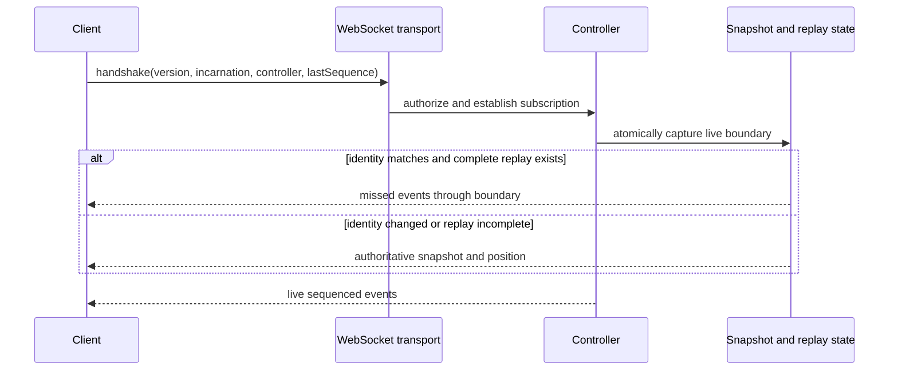
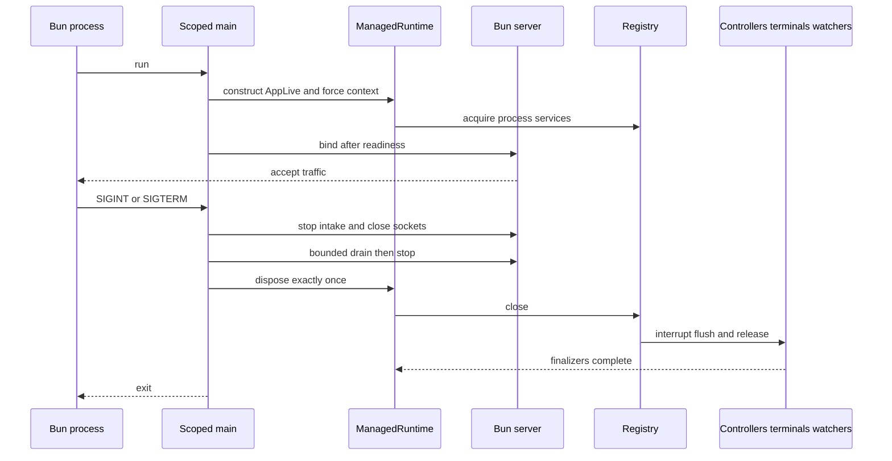
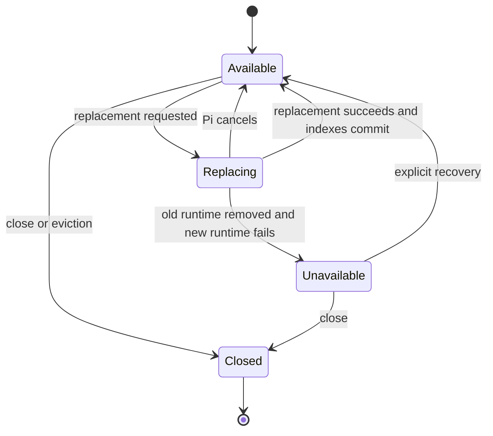

# Oh My ADE API Specification

## 1. Document control

| Field                | Value                                                                                       |
| -------------------- | ------------------------------------------------------------------------------------------- |
| Product              | Oh My ADE                                                                                   |
| Status               | Proposed; implementation pending                                                            |
| Scope                | Standalone Bun API, application runtime, Pi integration, host adapters, and shared protocol |
| Parent specification | [System](./system.spec.md)                                                                  |
| Peer specifications  | [Web](./web.spec.md), [Desktop](./desktop.spec.md)                                          |

The key words **MUST**, **MUST NOT**, **SHOULD**, **SHOULD NOT**, and **MAY** are normative. API requirements use the `API-FR`, `API-SEC`, and `API-NFR` prefixes. The requirements refine `SYS-FR-003`, `SYS-FR-010` through `SYS-FR-036`, `SYS-SEC-001` through `SYS-SEC-009`, and `SYS-NFR-001` through `SYS-NFR-005`.

## 2. Purpose

The API is an independently executable Bun process that embeds Pi through its in-process SDK. It owns authenticated access to agent sessions, models, workspaces, diffs, terminals, settings, and streaming events. Browser and desktop clients communicate only through the versioned Oh My ADE protocol.

Effect is the application runtime for service composition, scopes, concurrency, interruption, expected failures, and deterministic testing. Bun owns transport. Pi owns agent behavior and conversation persistence.

## 3. Scope

### 3.1 In scope

- Process startup, configuration, readiness, shutdown, and observability.
- HTTP resources, native WebSockets, authentication, authorization, Origin and CSRF enforcement.
- Process-global model/provider state and workspace-bound Pi runtimes.
- Long-lived agent session controllers and interactive terminal resources.
- Workspace trees, bounded file reads, Git state, diffs, and watchers.
- Protocol schemas, snapshots, event replay, command correlation, and public errors.
- Pi extension approvals and supported extension UI interactions.

### 3.2 Out of scope

- React rendering, client routing, and local UI state.
- Tauri windowing, plugins, and native operating-system UX.
- Pi RPC mode, Pi TUI rendering, or exposing Pi SDK shapes on the wire.
- A generic filesystem server, unrestricted shell API, or security sandbox.
- Package installation/update APIs and public multi-tenant hosting.

## 4. Architecture

### 4.1 Runtime context

### 4.2 Architectural boundaries

| Boundary          | Rule                                                                                                                  |
| ----------------- | --------------------------------------------------------------------------------------------------------------------- |
| Transport         | `Bun.serve()` owns routes, responses, upgrades, sockets, static files, payload limits, and backpressure signals.      |
| Application       | One process-wide Effect `ManagedRuntime` owns stable services and supervises dynamic resources.                       |
| Dynamic resources | Agent controllers and terminals use retained child scopes; request or socket scopes never own accepted work.          |
| Pi adapter        | Only server-side adapter modules import Pi; projections copy Pi values into protocol-owned values.                    |
| Protocol          | Public types contain no Pi, Effect, Bun, filesystem, provider-internal, credential, or unrestricted host-path values. |
| Persistence       | Pi owns conversation persistence; `MetadataStore` owns only Oh My ADE settings, trust, and metadata.                  |

### 4.3 Effect usage

The API MUST use Effect for:

- process service composition and validated configuration;
- acquisition and release of runtimes, subscriptions, watchers, terminals, and background work;
- session command/event queues, publication, snapshots, replay, interruption, and deadlines;
- typed expected failures and test substitution.

The API MUST keep the following outside Effect:

- Bun route declaration, response construction, static serving, and upgrade mechanics;
- pure protocol decoding/projection and synchronous transformations;
- client code; and
- Pi-owned retry, compaction retry, queue semantics, persistence, and agent state transitions.

Exactly one managed runtime MUST exist per process. Application services MUST compose effects and MUST NOT call Effect runners. `runPromiseExit` belongs only at Bun Promise/callback boundaries. Effect MUST supervise Pi rather than duplicate Pi's runtime.

## 5. Implementation baseline

### 5.1 Current repository state

At the time of this specification, `apps/api` and `packages/protocol` do not exist. The API is a target design, not a description of implemented behavior. Delivery begins with the compatibility spike in section 13.

### 5.2 Pinned integration baseline

| Dependency                        | Required baseline                |
| --------------------------------- | -------------------------------- |
| Bun                               | `1.4.0`                          |
| `@earendil-works/pi-coding-agent` | `0.84.2`                         |
| `effect`                          | `4.0.0-beta.107`                 |
| `@effect/platform-bun`            | `4.0.0-beta.107`                 |
| `@effect/vitest`                  | `4.0.0-beta.107` when introduced |

Integration-sensitive versions MUST be exact. An upgrade MUST review changed declarations and pass the pinned SDK contract suite before merging. The API package MUST declare Pi directly and MUST NOT rely on a globally linked installation.

## 6. Functional requirements

### 6.1 Process and transport

| ID         | Requirement                                                                                                                                          |
| ---------- | ---------------------------------------------------------------------------------------------------------------------------------------------------- |
| API-FR-001 | The process MUST validate configuration and acquire required services before accepting traffic.                                                      |
| API-FR-002 | The server MUST bind explicitly to `127.0.0.1:31415` by default.                                                                                     |
| API-FR-003 | The server MUST expose `GET /api/v1/health` with liveness, readiness, protocol version, and server incarnation.                                      |
| API-FR-004 | Resource operations MUST be exposed below `/api/v1`; interactive traffic MUST use `/api/v1/ws`.                                                      |
| API-FR-005 | Unknown `/api/*` routes MUST return an API error and MUST NOT fall through to the SPA document.                                                      |
| API-FR-006 | Production mode MUST serve the compiled web assets without mounting any workspace as a static directory.                                             |
| API-FR-007 | Every request and command MUST have a correlation identifier used in structured diagnostics.                                                         |
| API-FR-008 | Shutdown MUST reject new intake, close tracked sockets, perform a bounded drain, stop Bun, dispose the managed runtime once, and run all finalizers. |

### 6.2 Sessions and runs

| ID         | Requirement                                                                                                                                                              |
| ---------- | ------------------------------------------------------------------------------------------------------------------------------------------------------------------------ |
| API-FR-010 | `RuntimeRegistry` MUST own one retained child scope per active session controller.                                                                                       |
| API-FR-011 | A controller MUST own a serialized command queue, current snapshot, sequence counter, bounded replay, publication mechanism, Pi runtime, and supervised work.            |
| API-FR-012 | Prompt acknowledgement MUST use Pi preflight acceptance and MUST NOT wait for the completed run.                                                                         |
| API-FR-013 | An accepted run MUST continue independently of the initiating request or WebSocket.                                                                                      |
| API-FR-014 | A second prompt MUST NOT replace or interrupt an existing agent run; steer and follow-up MUST target the current run.                                                    |
| API-FR-015 | Abort MUST be idempotent at the application boundary and MUST wait for Pi to reach an idle state.                                                                        |
| API-FR-016 | The API MUST support model selection, thinking controls, tool catalog/state, queue modes, compaction, retry visibility, and direct bash according to Pi capabilities.    |
| API-FR-017 | Closing, eviction, unrecoverable failure, or process shutdown MUST close the controller scope exactly once.                                                              |
| API-FR-018 | Successful Pi runtime replacement MUST retain the controller identity, rebind extensions/subscriptions, update registry indexes atomically, and emit `session_replaced`. |
| API-FR-019 | If Pi destroys the old runtime and replacement fails, the controller MUST become unavailable and stale indexes MUST be removed.                                          |

### 6.3 Session management

| ID         | Requirement                                                                                                                                                                      |
| ---------- | -------------------------------------------------------------------------------------------------------------------------------------------------------------------------------- |
| API-FR-020 | The API MUST support session list, create, resume, switch, fork, clone, import, rename, labels, tree navigation, stats, and controlled export where supported by Pi.             |
| API-FR-021 | Replacement operations MUST serialize with session mutations and MUST honor Pi cancellation without changing indexes or emitting replacement events.                             |
| API-FR-022 | Session snapshots MUST contain protocol-owned identity, messages, partial output, model, thinking, tools, run state, queues, tree cursor, usage, resources, and latest sequence. |
| API-FR-023 | Final Pi messages and durable session entries MUST be authoritative; deltas MUST be treated as transient rendering accelerators.                                                 |

### 6.4 Workspaces and diffs

| ID         | Requirement                                                                                                                                                            |
| ---------- | ---------------------------------------------------------------------------------------------------------------------------------------------------------------------- |
| API-FR-030 | `WorkspaceExplorer` MUST expose authorized tree snapshots, bounded reads, Git status/diffs, and coalesced change subscriptions.                                        |
| API-FR-031 | Workspace values MUST contain opaque workspace IDs and canonical relative paths, never unrestricted absolute paths.                                                    |
| API-FR-032 | Tree snapshots and changes MUST carry revisions; stale or conflicting updates MUST trigger a conflict or resnapshot.                                                   |
| API-FR-033 | Reads and diffs MUST detect binary content, enforce byte/line limits, and describe truncation.                                                                         |
| API-FR-034 | Diff documents MUST identify workspace, path, source, revisions, language hint, binary/truncation state, and bounded content or validated patch.                       |
| API-FR-035 | Filesystem mutations and diff accept/reject MUST remain unavailable until separately specified with authorization, conflicts, symlinks, audit, and expected revisions. |
| API-FR-036 | Pierre tree/diff packages MUST remain client-only and MUST NOT appear in server or protocol types.                                                                     |

### 6.5 Interactive terminals

| ID         | Requirement                                                                                                                                   |
| ---------- | --------------------------------------------------------------------------------------------------------------------------------------------- |
| API-FR-040 | `TerminalRegistry` MUST own every PTY in a retained child scope independently of Pi sessions.                                                 |
| API-FR-041 | Opening a terminal MUST validate caller, workspace, trust, policy, cwd, environment allowlist, and dimensions.                                |
| API-FR-042 | A terminal MUST have an opaque ID, access policy, workspace, ordered sequence, bounded replay, dimensions, activity time, and one active PTY. |
| API-FR-043 | The protocol MUST support open, input, resize, signal, close, output, exit, overflow, and diagnostics.                                        |
| API-FR-044 | An authorized terminal MAY survive disconnect for a configured grace period and MUST close after the grace period expires.                    |
| API-FR-045 | A terminal environment MUST omit model credentials, server secrets, and unrelated host environment values.                                    |
| API-FR-046 | Remote terminal access MUST be disabled by default until authentication, TLS, audit, and isolation policy are configured.                     |

### 6.6 Models, settings, resources, and extensions

| ID         | Requirement                                                                                                                                                                                 |
| ---------- | ------------------------------------------------------------------------------------------------------------------------------------------------------------------------------------------- |
| API-FR-050 | One process-global model service MUST own the canonical Pi `ModelRuntime`, provider catalog, credential status/mutations, refresh deadlines, and trusted provider registration.             |
| API-FR-051 | Each effective cwd MUST receive fresh workspace-bound Pi services, settings merge, resource loader, tools, paths, and trust state.                                                          |
| API-FR-052 | The API MUST expose protocol-owned model summaries and MUST NOT expose credentials, provider request configuration, or raw model objects.                                                   |
| API-FR-053 | Settings mutations MUST respect Pi global/project scope, project trust, and durability boundaries; write failures MUST surface as diagnostics or errors.                                    |
| API-FR-054 | Resource listing and reload MUST expose safe commands, skills, prompts, themes, diagnostics, and trust state without filesystem-backed implementation objects.                              |
| API-FR-055 | Server approval policy MUST execute before user confirmation; unattended or timed-out approvals MUST fail closed.                                                                           |
| API-FR-056 | Supported extension UI operations—select, confirm, input, editor, notify, status, text widgets, title, and editor text—MUST map to correlated protocol events or documented no-op behavior. |
| API-FR-057 | Pi TUI components, overlays, renderers, custom terminal input, footers, headers, and terminal themes MUST NOT be presented as supported React integrations.                                 |

## 7. Protocol specification

### 7.1 Protocol invariants

| ID         | Requirement                                                                                                                                                                           |
| ---------- | ------------------------------------------------------------------------------------------------------------------------------------------------------------------------------------- |
| API-FR-060 | `packages/protocol` MUST export versioned, runtime-validated discriminated unions for resources, commands, acknowledgements, snapshots, events, and public errors.                    |
| API-FR-061 | Every command MUST contain protocol version, command ID, command type, target identity, and payload; mutations MUST include an expected revision or documented last-writer-wins rule. |
| API-FR-062 | Every streamed event MUST contain protocol version, server incarnation, stream identity, sequence, event type, and payload.                                                           |
| API-FR-063 | Command IDs MUST be deduplicated with a bounded result cache within one server incarnation.                                                                                           |
| API-FR-064 | Subscription establishment MUST atomically capture the replay boundary and return complete replay or a snapshot plus live position.                                                   |
| API-FR-065 | Server-incarnation or controller mismatch MUST require a fresh snapshot; ambiguous mutations MUST NOT be retried automatically.                                                       |
| API-FR-066 | Credentials, stack traces, unrestricted paths, raw provider responses, and unbounded tool output MUST NOT be serialized.                                                              |

### 7.2 Transport allocation

| HTTP resources                                                     | WebSocket interactions                   |
| ------------------------------------------------------------------ | ---------------------------------------- |
| health and readiness                                               | handshake and subscription               |
| workspace/session/model/settings listings                          | prompt, steer, follow-up, abort          |
| tree snapshots, bounded files, and diffs                           | agent and tool lifecycle events          |
| bounded authenticated attachments                                  | approvals and extension UI               |
| initial snapshots and controlled exports                           | terminal commands and output             |
| session creation and resource mutations suited to request/response | workspace changes and reconnect recovery |

### 7.3 Reconnection

### 7.4 Event bridge

Pi callbacks MUST synchronously copy a minimal immutable envelope into one controller ingress queue and return. One event-pump fiber MUST project events, update the snapshot, allocate sequence numbers, append replay, and publish live events in order.

The ingress queue is lossless while open because deltas may not yet be reconstructable, but it MUST have warning thresholds and a fail-safe operational ceiling before remote multi-user deployment. Live publication MUST be sliding or otherwise bounded so slow subscribers cannot backpressure Pi. A detected gap MUST initiate replay or snapshot recovery.

### 7.5 Pi capability disposition

The adapter MUST classify Pi capabilities as follows. “Protocol” means an authenticated application-owned command/resource; “internal” means server or trusted-extension use only.

| Pi capability                                                              | Disposition                                                                |
| -------------------------------------------------------------------------- | -------------------------------------------------------------------------- |
| Prompt, steer, follow-up, clear queue, wait for idle, and abort            | Protocol; prompt uses preflight acceptance and supervised completion       |
| Send user/custom message                                                   | Internal trusted-extension operation; not an authentication bypass         |
| Model selection/cycling and thinking-level controls                        | Protocol using resolved model identities and effective capability values   |
| Active/all tools and tool activation                                       | Protocol summaries/settings with safe provenance; no raw Pi tool objects   |
| Steering/follow-up delivery modes                                          | Protocol settings and snapshots                                            |
| Manual/auto compaction and retry                                           | Protocol controls/status; Pi owns the retry implementation                 |
| Direct bash stream/abort                                                   | Protocol but distinct from tool bash and interactive PTYs                  |
| Session state, messages, usage, cost, context, name, stats, and export     | Protocol-owned snapshots/resources and controlled export                   |
| New, switch, fork, clone, import, list, tree, leaf, labels, and navigation | Protocol through serialized runtime/session-manager operations             |
| Provider/model catalogs and authentication                                 | Protocol summaries and secure interactions; credentials remain server-side |
| Custom provider registration and low-level raw model APIs                  | Internal trusted integrations only                                         |
| Resource commands, skills, prompts, themes, diagnostics, reload, and trust | Protocol-owned resources/settings with safe projections                    |
| Settings global/project merge and persistence                              | Protocol settings with trust and durability enforcement                    |
| Extension approvals and supported UI methods                               | Protocol bridge through `ApprovalBroker`                                   |
| Low-level mutable `agent` access                                           | Internal adapter only; never exposed to clients                            |

### 7.6 Pi event coverage

| Pi event category                                                     | Required protocol treatment                                                     |
| --------------------------------------------------------------------- | ------------------------------------------------------------------------------- |
| `agent_start`, `agent_end`, `agent_settled`                           | Running, low-level completion/retry, and authoritative settled state            |
| `turn_start`, `turn_end`                                              | Turn lifecycle and authoritative completed turn                                 |
| `message_start`, `message_update`, `message_end`                      | Live shell, indexed text/thinking/tool deltas, then authoritative final message |
| `tool_execution_start`, `tool_execution_update`, `tool_execution_end` | Correlated tool lifecycle keyed by tool-call identity                           |
| `queue_update`                                                        | Replace steering/follow-up queue snapshot                                       |
| `entry_appended`                                                      | Append or reconcile durable entry                                               |
| `session_info_changed`                                                | Update public session information                                               |
| `thinking_level_changed`                                              | Update effective thinking level                                                 |
| Compaction and summarization retry events                             | Compaction/summary lifecycle, attempts, and safe result/error                   |
| Automatic retry events                                                | Attempt lifecycle and safe provider error                                       |
| `bash_execution_update`                                               | Correlated direct-bash output                                                   |

Unknown subscribed events or message/tool delta variants MUST emit an SDK compatibility diagnostic and trigger snapshot reconciliation rather than being silently ignored. Approval and extension errors enter the same sequenced stream through their server bridges.

## 8. Process and resource lifecycle

### 8.1 Process services

| Service             | Responsibility                                                                                |
| ------------------- | --------------------------------------------------------------------------------------------- |
| `ServerConfig`      | Bind, data paths, allowed roots, authentication, logging, limits, and shutdown grace.         |
| `RuntimeRegistry`   | Controller lookup, open/close, snapshots, subscriptions, eviction, replacement, and shutdown. |
| `PiModelRuntime`    | Process-global models, providers, and credential adapter.                                     |
| `PiRuntimeFactory`  | Acquisition of cwd-bound Pi runtimes.                                                         |
| `WorkspaceExplorer` | Trees, reads, Git, diffs, revisions, and watches.                                             |
| `TerminalRegistry`  | PTYs, access, replay, disconnect grace, and shutdown.                                         |
| `WorkspaceService`  | Canonicalization, allowlists, trust, and safe references.                                     |
| `MetadataStore`     | Oh My ADE settings and trusted workspace metadata.                                            |
| `ApprovalBroker`    | Correlated, authenticated approval and extension interactions.                                |

Pure helpers MUST remain ordinary functions. Dynamic sessions and terminals MUST remain registry-owned scoped resources rather than layers.

### 8.2 Session replacement

After every successful replacement, code MUST re-read `runtime.session` and `runtime.services`; captured old session, manager, loader, extension, or cwd-bound values MUST NOT be reused.

## 9. Error model

Expected errors MUST be schema-backed tagged application failures and map to stable public codes. Initial groups include:

- invalid request, authentication, authorization, and server shutdown;
- workspace not allowed, trust required, entry missing, revision conflict, and file too large;
- session missing, conflict, unavailable, and operation interrupted;
- terminal missing, forbidden, and unavailable;
- Pi unavailable, operation failed, model authentication unavailable, and replacement failed;
- persistence, credential synchronization, resource reload, and approval failures.

Unexpected failures are defects. The boundary MUST log their structured causes and return an opaque internal error with the request identifier. Failures after prompt acceptance MUST be emitted as lifecycle or diagnostic events, never a second command response.

## 10. Security requirements

| ID          | Requirement                                                                                                                                         |
| ----------- | --------------------------------------------------------------------------------------------------------------------------------------------------- |
| API-SEC-001 | Configuration MUST reject unsafe non-loopback binding unless remote access is explicitly enabled.                                                   |
| API-SEC-002 | HTTP and WebSocket operations MUST authenticate the caller and authorize the target resource.                                                       |
| API-SEC-003 | Browser WebSockets MUST use a secure cookie or short-lived, single-use ticket because browser clients cannot set an arbitrary authorization header. |
| API-SEC-004 | HTTP and upgrade requests MUST validate Origin; cookie mutations MUST validate CSRF tokens bound to the authenticated session.                      |
| API-SEC-005 | WebSocket payload, backpressure, idle, outbound queue, and rate limits MUST be configured.                                                          |
| API-SEC-006 | Workspace canonicalization MUST prevent traversal and symlink escape, including writes to nonexistent targets when mutations are later introduced.  |
| API-SEC-007 | Interactive terminal authorization MUST communicate that it is direct host-code execution, not sandboxed execution.                                 |
| API-SEC-008 | Public errors and logs MUST not disclose secrets or unrestricted host paths.                                                                        |
| API-SEC-009 | Controlled uploads and exports MUST validate ownership, media type, size, expiry, and availability.                                                 |

## 11. Quality requirements

| ID          | Requirement                                                                                                                                                                         |
| ----------- | ----------------------------------------------------------------------------------------------------------------------------------------------------------------------------------- |
| API-NFR-001 | Separate controllers MUST be able to execute concurrently; mutations within one controller MUST preserve queue order.                                                               |
| API-NFR-002 | Session, terminal, watcher, and server finalizers MUST be idempotent and observable.                                                                                                |
| API-NFR-003 | HTTP bodies, WebSocket messages, event ingress, replay count/bytes, subscribers, controllers, terminals, trees, files, diffs, attachments, and deadlines MUST have explicit limits. |
| API-NFR-004 | Route and pipeline behavior MUST be testable without opening a port; native integration tests MUST use an ephemeral port.                                                           |
| API-NFR-005 | Core message, tool delta, and subscribed Pi event variants MUST be exhaustively handled or generate a compatibility diagnostic and reconciliation.                                  |
| API-NFR-006 | Logs and spans MUST correlate request, command, controller, workspace, terminal, run, and tool identities where applicable.                                                         |
| API-NFR-007 | Content logging MUST be redacted, opt-in, and disabled by default.                                                                                                                  |

Required operational metrics include startup/shutdown duration, active controllers/terminals/runs, queue depth, replay use, dropped live publications, reconnect outcome, workspace resnapshots, approval latency, and Pi/provider failures.

## 12. Verification

### 12.1 Unit and protocol tests

- Configuration decoding and unsafe bind rejection.
- Protocol round trips and invalid input rejection.
- Error-to-transport mapping and opaque defect behavior.
- Pure Pi projection and exhaustive event/delta handling.
- Snapshot transitions, replay, deduplication, and revision conflicts.
- Path containment, symlinks, ignore rules, Git status, binary detection, and limits.

### 12.2 Effect service tests

Tests MUST use substitute layers, controllable clocks, and deterministic synchronization rather than sleeps. They cover command serialization, cross-session concurrency, prompt exclusivity, disconnect survival, interruption-to-Pi abort, finalizer idempotence, gap-free subscription, slow subscribers, terminal replay/closure, watcher cleanup, and process shutdown.

### 12.3 Bun transport tests

Tests cover health, authentication, authorization, validation, not-found behavior, IDs, WebSocket upgrade, Origin/ticket/CSRF policy, payload/backpressure limits, terminal I/O, workspace events, reconnect negotiation, static serving, and graceful shutdown.

### 12.4 Pinned Pi contract tests

The compatibility suite MUST cover:

- session acquisition, disposal, settings flush, and replacement failure;
- preflight timing and accepted runs outliving clients;
- text, thinking, tool, retry, compaction, settled, and queue behavior;
- abort, model authentication, thinking clamping, and direct bash;
- session list/tree/name/labels/stats/export and navigation cancellation;
- extension lifecycle, approval outcomes, resource trust, and diagnostics;
- credential synchronization partial failure; and
- unknown event compatibility fallback.

## 13. Delivery sequence

This section is informative; requirements and acceptance criteria remain normative.

1. Prove Bun, Effect, Pi, child process, watcher, terminal, signal, replacement, streaming, approval, interruption, and disposal compatibility using the pinned versions.
2. Create `apps/api` and `packages/protocol`; implement configuration, runtime, secure transport pipeline, health, shutdown, and tests.
3. Implement one scoped controller with prompt, streaming, abort, snapshot, replay, and disconnect survival.
4. Implement authorized workspace trees, reads, diffs, watchers, and interactive terminals.
5. Add complete session management, persistence boundaries, and runtime replacement.
6. Add model, credential, setting, resource, and trust operations.
7. Add approval/extension bridges, authentication, pairing, authorization, and remote safeguards.
8. Add production limits, observability, eviction, recovery tests, and static web serving.

The later phases are blocked if the compatibility spike shows that Pi cannot be supported safely under Bun. A fallback runtime requires a separate architecture decision.

## 14. Acceptance criteria

The API specification is satisfied when:

1. Exactly one managed runtime exists; request/socket scopes do not own accepted runs.
2. The API binds safely, validates before listening, and shuts down in the required order.
3. Agent runs survive disconnects and controller, terminal, watcher, and subscription resources finalize exactly once.
4. Protocol schemas contain only application-owned bounded values, with stable errors, revisions, stream identities, sequence numbers, and recovery behavior.
5. Pi runtime replacement cannot leave stale registry keys or subscriptions.
6. Workspace and terminal access enforce authorization, containment, trust, limits, and secret filtering.
7. Every capability in this specification is implemented, explicitly deferred, or deliberately excluded.
8. Unit, service, Bun transport, pinned Pi contract, typecheck, lint, format, and production build checks pass.

## 15. Open decisions

- Schema implementation for the shared browser protocol, subject to runtime-validation ergonomics and production bundle size.
- Authentication, pairing, and credential-storage design for the first private-remote release.
- Operational limit defaults and controller/terminal eviction policy.
- Supported terminal hosts and fallback behavior where `Bun.Terminal` is unavailable.
- Storage format and migration policy for Oh My ADE metadata.
