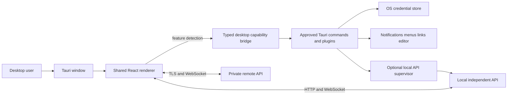
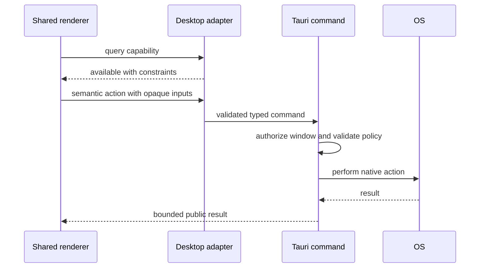
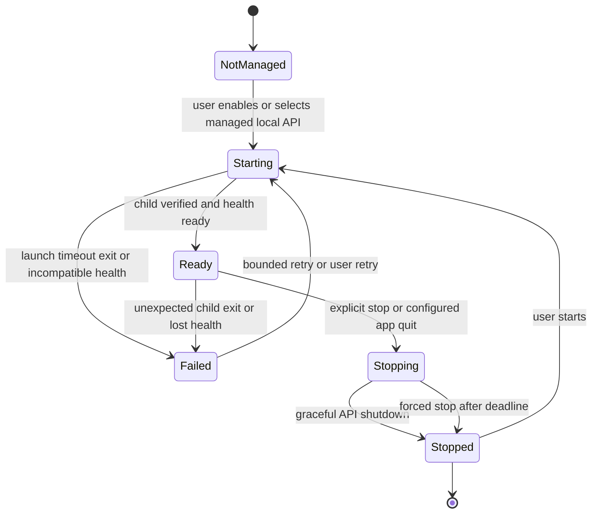

# Oh My ADE Desktop Specification

## 1. Document control

| Field                | Value                                                                                    |
| -------------------- | ---------------------------------------------------------------------------------------- |
| Product              | Oh My ADE                                                                                |
| Status               | Proposed; minimal Tauri scaffold exists                                                  |
| Scope                | Tauri 2 host, packaging, native capabilities, and optional local API process integration |
| Parent specification | [System](./system.spec.md)                                                               |
| Peer specifications  | [API](./api.spec.md), [Web](./web.spec.md)                                               |

The key words **MUST**, **MUST NOT**, **SHOULD**, **SHOULD NOT**, and **MAY** are normative. Desktop requirements use the `DESK-FR`, `DESK-SEC`, and `DESK-NFR` prefixes. They refine `SYS-FR-001` through `SYS-FR-006`, `SYS-SEC-002`, `SYS-SEC-004`, `SYS-SEC-006`, `SYS-SEC-008`, and `SYS-NFR-001`, `SYS-NFR-005`, and `SYS-NFR-006`.

## 2. Purpose

The desktop application packages the shared React renderer in a Tauri 2 host and adds narrowly scoped operating-system integrations. It is a client of the same independently executable API used by browsers. It may make a local API convenient to install, discover, launch, monitor, and stop, but it does not redefine the server or own agent runs.

## 3. Scope

### 3.1 In scope

- Native application window, menus, lifecycle, packaging, signing, and updates.
- Secure storage for client authentication material.
- Local API discovery and optional sidecar launch/monitoring.
- Notifications, tray behavior, deep links, global shortcuts, and launch-on-login when explicitly implemented.
- Explicit actions such as opening a server-host file in an editor when the endpoint is local and the mapping is safe.
- A small, typed, capability-checked bridge used by the shared renderer.

### 3.2 Out of scope

- A separate desktop renderer or direct Pi integration.
- Owning, cancelling, or persisting agent runs merely because a window closes.
- Generic WebView access to shell, filesystem, process, keychain, or unrestricted Tauri invoke.
- Assuming a path on a remote API host exists on the desktop-client host.
- Bundling native features without a permission, threat, failure, and platform-support design.

## 4. Architecture

### 4.1 Desktop context

### 4.2 Ownership boundaries

| Concern                                                      | Owner                                                                                               |
| ------------------------------------------------------------ | --------------------------------------------------------------------------------------------------- |
| Agent sessions, runs, workspaces, terminals, and persistence | API host                                                                                            |
| Conversation and workspace UI                                | Shared web renderer                                                                                 |
| Window, menu, tray, notifications, deep links, and shortcuts | Tauri host                                                                                          |
| Client credential at rest                                    | Approved OS credential-store plugin/command                                                         |
| API credentials in use                                       | Narrow connection adapter; never general renderer storage                                           |
| Optional child API process                                   | Desktop supervisor for process mechanics; API remains responsible for its own application lifecycle |

### 4.3 Renderer bridge

The bridge MUST expose semantic capabilities rather than generic native primitives. For example, `openServerFileInEditor` is acceptable only after endpoint locality and path mapping are established; unrestricted `readFile`, `spawn`, or arbitrary `invoke` is not.

## 5. Current implementation baseline

The repository currently has a minimal Tauri 2 scaffold:

| Area                    | Current state                                                                                       |
| ----------------------- | --------------------------------------------------------------------------------------------------- |
| Renderer                | Loads Vite at `http://localhost:5173` in development and `apps/web/dist` in production              |
| Window                  | One resizable `800 × 600` main window with a custom Windows/Linux frame and macOS title-bar overlay |
| Native code             | Starts Tauri and enables the log plugin only in debug builds                                        |
| Capabilities            | Main window has `core:default` plus four scoped window-control permissions                          |
| Packaging               | All Tauri bundle targets enabled with scaffold icons                                                |
| Content security policy | `csp: null`; this is a known release blocker                                                        |
| API integration         | No endpoint configuration, credentials, discovery, sidecar, or lifecycle integration exists         |

This baseline is scaffolding and does not satisfy the release requirements below.

## 6. Functional requirements

### 6.1 Shared renderer and window

| ID          | Requirement                                                                                                                                                                                                 |
| ----------- | ----------------------------------------------------------------------------------------------------------------------------------------------------------------------------------------------------------- |
| DESK-FR-001 | The application MUST load the same production renderer built by `apps/web`; it MUST NOT contain a second renderer implementation.                                                                           |
| DESK-FR-002 | Core session workflows MUST remain functional through the API when all optional native capabilities are unavailable.                                                                                        |
| DESK-FR-003 | The main window MUST restore only validated, visible bounds and MUST recover safely when displays change or are removed.                                                                                    |
| DESK-FR-004 | Window close MUST detach the client and MUST NOT imply session close, run abort, terminal close, or API shutdown.                                                                                           |
| DESK-FR-005 | Application quit MAY stop a desktop-launched local API according to an explicit user setting, but MUST first request its graceful shutdown and MUST communicate active-work consequences.                   |
| DESK-FR-006 | External links MUST open through an allowlisted safe mechanism rather than unrestricted WebView navigation.                                                                                                 |
| DESK-FR-007 | The main window MUST expose draggable header space and accessible window controls: renderer-owned controls with hidden decorations on Windows/Linux, and native controls in an overlaid title bar on macOS. |

#### 6.1.1 Custom title bar capability

- The custom title bar lets desktop users drag, minimize, maximize or restore, and close the main window from the shared application header.
- It is supported by Tauri on Windows, macOS, and Linux; macOS uses its native overlaid traffic lights to retain system corners and shadows, Windows/Linux use renderer controls, and controls are omitted in ordinary browsers.
- On Windows/Linux, the renderer exposes only feature detection and the semantic `minimizeDesktopWindow`, `toggleDesktopWindowMaximized`, and `closeDesktopWindow` adapter operations; macOS reserves header space for native controls.
- The operations use Tauri's built-in window API for the current named window and accept no renderer-provided input.
- The `main` window receives `core:window:allow-start-dragging` on every desktop platform; close, minimize, and maximize permissions are additionally scoped to Windows/Linux.
- The capability handles no sensitive data and retains no state.
- A failed operation leaves the window unchanged and is reported to renderer diagnostics; closing follows the normal application lifecycle.
- Typecheck, web production build, Tauri capability validation, and platform interaction/accessibility smoke tests cover this integration; release signing behavior is unchanged.

### 6.2 API endpoint and connection

| ID          | Requirement                                                                                                                           |
| ----------- | ------------------------------------------------------------------------------------------------------------------------------------- |
| DESK-FR-010 | The desktop application MUST support a configured local or private remote API endpoint accepted by the web client's validation rules. |
| DESK-FR-011 | The UI MUST clearly identify whether the active API is local, desktop-managed local, or remote.                                       |
| DESK-FR-012 | Remote endpoints MUST require TLS except for an explicitly designed development override.                                             |
| DESK-FR-013 | Endpoint changes MUST clear or partition credentials, cached identities, drafts, and native path mappings by endpoint.                |
| DESK-FR-014 | The desktop host MUST NOT rewrite protocol messages or become a second source of session truth.                                       |

### 6.3 Local API discovery and supervision

| ID          | Requirement                                                                                                                                             |
| ----------- | ------------------------------------------------------------------------------------------------------------------------------------------------------- |
| DESK-FR-020 | The application MAY discover a healthy local API through an explicit port/configuration strategy without scanning arbitrary hosts or broad port ranges. |
| DESK-FR-021 | If sidecar management is enabled, the packaged API executable and its version MUST be verified before launch.                                           |
| DESK-FR-022 | Sidecar launch MUST pass an explicit, minimal configuration and MUST NOT copy the full desktop process environment.                                     |
| DESK-FR-023 | The supervisor MUST distinguish starting, ready, failed, stopping, stopped, and externally managed states.                                              |
| DESK-FR-024 | Readiness MUST be determined through the API health contract, not merely by observing a child process.                                                  |
| DESK-FR-025 | A sidecar crash MUST be visible to the renderer; restart behavior MUST be bounded and MUST not create multiple competing API instances.                 |
| DESK-FR-026 | The supervisor MUST request graceful API shutdown before a forced termination and MUST honor the configured shutdown deadline.                          |
| DESK-FR-027 | The desktop application MUST allow connecting to an already running compatible local API without taking ownership of that process.                      |

### 6.4 Credentials

| ID          | Requirement                                                                                                                                                                 |
| ----------- | --------------------------------------------------------------------------------------------------------------------------------------------------------------------------- |
| DESK-FR-030 | Long-lived client authentication material MUST be stored with a vetted operating-system credential-store integration.                                                       |
| DESK-FR-031 | The WebView MUST receive only the minimum short-lived material needed to authenticate the current connection.                                                               |
| DESK-FR-032 | Credentials MUST be keyed by normalized endpoint and account/device identity and MUST be removable from settings.                                                           |
| DESK-FR-033 | Pairing MUST display the endpoint and server identity and MUST require explicit confirmation before storing credentials.                                                    |
| DESK-FR-034 | Model-provider credentials belong to the API host and MUST NOT be stored by the desktop client unless a separately specified secure transfer flow requires transient input. |

### 6.5 Native integrations

| ID          | Requirement                                                                                                                                            |
| ----------- | ------------------------------------------------------------------------------------------------------------------------------------------------------ |
| DESK-FR-040 | Notifications MAY report approval requests, completed runs, or failures only according to user settings and safe content-redaction policy.             |
| DESK-FR-041 | Clicking a notification MUST navigate to the correct endpoint/session using validated identifiers.                                                     |
| DESK-FR-042 | Menus and global shortcuts MUST invoke semantic renderer actions and MUST respect focus, platform conventions, and configurable conflicts.             |
| DESK-FR-043 | Deep links MUST validate scheme, endpoint, route, and identifiers and MUST require confirmation before security-sensitive endpoint or pairing changes. |
| DESK-FR-044 | Tray and background behavior MUST clearly state whether closing the window leaves the desktop process or managed API running.                          |
| DESK-FR-045 | Launch-on-login MUST be opt-in and MUST not silently start a remote connection, terminal, or agent run.                                                |

### 6.6 Host-aware file actions

| ID          | Requirement                                                                                                                                                   |
| ----------- | ------------------------------------------------------------------------------------------------------------------------------------------------------------- |
| DESK-FR-050 | Native file/editor actions MUST be disabled for remote API-host resources unless an explicit safe mapping to the desktop host exists.                         |
| DESK-FR-051 | The renderer MUST send opaque workspace/path references, not unrestricted paths, to a native action.                                                          |
| DESK-FR-052 | The native host MUST resolve allowed references through a validated local-endpoint mapping and MUST reject traversal, symlink escape, and unknown workspaces. |
| DESK-FR-053 | Editor/terminal launch commands MUST use allowlisted applications and structured arguments; they MUST NOT concatenate shell command strings.                  |
| DESK-FR-054 | Failures MUST distinguish unavailable capability, remote resource, invalid mapping, denied permission, missing application, and operating-system error.       |

## 7. Lifecycle

### 7.1 Desktop-managed local API

The supervisor MUST persist enough ownership information to avoid killing an unrelated process after restart. A PID alone is insufficient; executable identity, launch token, and health/server incarnation SHOULD be correlated.

### 7.2 Application events

| Event            | Required behavior                                                                        |
| ---------------- | ---------------------------------------------------------------------------------------- |
| Window close     | Follow explicit background/tray preference; detach renderer only.                        |
| Application quit | Flush desktop settings; optionally stop only the owned sidecar according to policy.      |
| OS shutdown      | Attempt bounded cleanup without assuming completion.                                     |
| Suspend/resume   | Treat connections as stale, re-check health, and use normal replay/snapshot recovery.    |
| Network change   | Revalidate endpoint reachability without changing endpoint trust automatically.          |
| App update       | Preserve compatible settings and credentials; revalidate sidecar/protocol compatibility. |

## 8. Security requirements

| ID           | Requirement                                                                                                                                                              |
| ------------ | ------------------------------------------------------------------------------------------------------------------------------------------------------------------------ |
| DESK-SEC-001 | Production builds MUST define a restrictive content security policy; the current `csp: null` MUST block release.                                                         |
| DESK-SEC-002 | Each Tauri command and plugin permission MUST be granted only to named windows that require it and MUST use the smallest capability set.                                 |
| DESK-SEC-003 | The renderer MUST NOT have generic shell, process, filesystem, environment, keychain, updater, or arbitrary invoke access.                                               |
| DESK-SEC-004 | Native command inputs MUST be typed, size-bounded, validated in Rust, and authorized independently of client-side checks.                                                |
| DESK-SEC-005 | Sidecar binaries, updates, and manifests MUST be integrity-verified and distributed through the signed application release process.                                      |
| DESK-SEC-006 | Logs, crash reports, notifications, and OS recent-item integrations MUST omit credentials, prompt/model content, tool arguments, and unrestricted host paths by default. |
| DESK-SEC-007 | Remote endpoint certificates MUST be validated normally; bypasses MUST be development-only, conspicuous, and impossible in production builds.                            |
| DESK-SEC-008 | Deep links and single-instance messages MUST be treated as untrusted input.                                                                                              |
| DESK-SEC-009 | Plugins MUST be vetted for maintenance, platform support, permission surface, and security history before adoption.                                                      |

### 8.1 Capability design

Every new native feature MUST document:

1. user-visible purpose;
2. supported operating systems;
3. renderer API and public result shape;
4. Rust-side validation and authorization;
5. exact Tauri/plugin permissions and window scope;
6. sensitive data handled and retention;
7. failure and cancellation behavior; and
8. tests and release-signing implications.

## 9. Quality requirements

### 9.1 Platform behavior

| ID           | Requirement                                                                                                                                     |
| ------------ | ----------------------------------------------------------------------------------------------------------------------------------------------- |
| DESK-NFR-001 | Supported Windows, macOS, and Linux versions and architectures MUST be defined before distribution.                                             |
| DESK-NFR-002 | Native UI, shortcuts, menus, notifications, paths, and lifecycle behavior MUST follow platform conventions.                                     |
| DESK-NFR-003 | Unsupported capabilities MUST degrade explicitly without breaking core browser-equivalent workflows.                                            |
| DESK-NFR-004 | The desktop application MUST remain usable with assistive technology supported by the platform WebView and the web accessibility specification. |

### 9.2 Reliability and diagnostics

| ID           | Requirement                                                                                                                          |
| ------------ | ------------------------------------------------------------------------------------------------------------------------------------ |
| DESK-NFR-010 | Sidecar launch, readiness, shutdown, restart, update, and failure paths MUST have bounded deadlines and structured diagnostics.      |
| DESK-NFR-011 | Native command cancellation and window destruction MUST not leak processes, handles, watchers, or sensitive buffers.                 |
| DESK-NFR-012 | Application, WebView, and API versions plus protocol compatibility MUST be available in a diagnostics view without exposing secrets. |
| DESK-NFR-013 | Crash recovery MUST not assume that a previously managed API is still owned or safe to terminate.                                    |

### 9.3 Packaging and updates

| ID           | Requirement                                                                                                         |
| ------------ | ------------------------------------------------------------------------------------------------------------------- |
| DESK-NFR-020 | Release artifacts MUST be signed/notarized as required by each supported platform.                                  |
| DESK-NFR-021 | Application and bundled API versions MUST declare a compatibility policy and fail clearly when incompatible.        |
| DESK-NFR-022 | Updates MUST preserve or migrate desktop settings and MUST not expose or silently discard credential-store entries. |
| DESK-NFR-023 | Production builds MUST exclude development servers, debug-only permissions, and verbose sensitive logging.          |

## 10. Verification

### 10.1 Rust and capability tests

- Typed command validation, authorization, size limits, and safe public errors.
- Endpoint normalization and credential partition/removal.
- Local resource mapping, traversal/symlink rejection, and allowlisted editor arguments.
- Deep-link validation and safe notification navigation.
- Capability files contain only intended permissions for intended windows.

### 10.2 Sidecar integration tests

- Verified launch, health readiness, incompatible version, port conflict, early exit, crash, bounded restart, graceful stop, forced deadline, and externally managed API.
- Window close and application quit while an agent run, terminal, or reconnect is active.
- Suspend/resume and network transition using normal API recovery.
- No model/server secrets inherited by child or exposed to renderer/logs.

### 10.3 Platform and release tests

For each supported operating system and architecture:

- install, first launch, renderer load, endpoint setup, pairing, update, and uninstall;
- window bounds, menus, shortcuts, notifications, tray, deep links, launch-on-login, and accessibility smoke tests where enabled;
- code signing/notarization and sidecar integrity;
- production CSP and absence of development-only capability; and
- local and private remote API scenarios.

## 11. Delivery sequence

This section is informative.

1. Replace the scaffold CSP with a production policy and establish the typed, feature-detected desktop bridge.
2. Implement endpoint configuration, local/remote identity, OS credential storage, and diagnostics.
3. Design, package, verify, launch, monitor, and gracefully stop the local API sidecar.
4. Add one native integration at a time with its capability design and platform tests.
5. Complete signing, notarization, update, migration, accessibility, and supported-platform release matrices.

## 12. Acceptance criteria

The desktop specification is satisfied when:

1. The signed application loads the same tested renderer as the browser build.
2. Core workflows work without optional native capabilities and against local or private remote APIs.
3. Closing a window does not abort server-owned work, and sidecar ownership/shutdown rules pass integration tests.
4. Credentials remain in approved OS storage and the WebView has no generic native access.
5. Production CSP, scoped capabilities, typed command validation, safe path mapping, and signed sidecar/update verification pass security review.
6. Every supported platform passes install, launch, connection, lifecycle, accessibility smoke, and update tests.

## 13. Open decisions

- Supported operating systems, minimum versions, architectures, and package formats.
- Sidecar packaging, compatibility, discovery, launch-token, and update strategy.
- Credential-store, notification, deep-link, single-instance, updater, and launch-on-login plugins.
- Tray/background defaults and whether quit stops an owned idle API.
- Safe local workspace-to-editor mapping and initial editor allowlist.
- Production content security policy sources required by the renderer.
