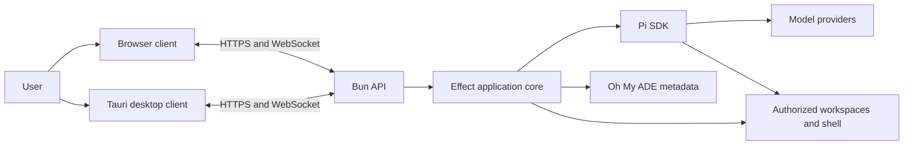
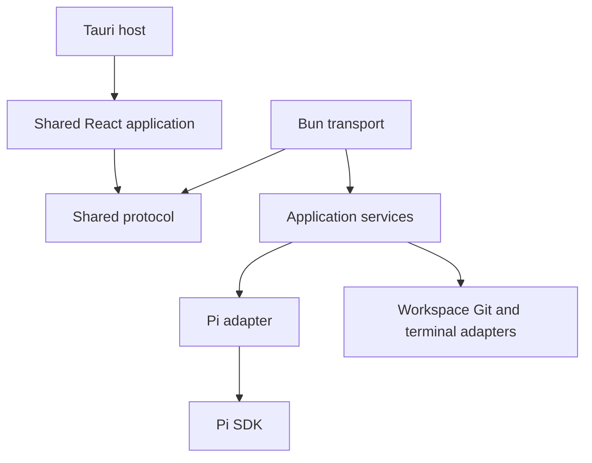
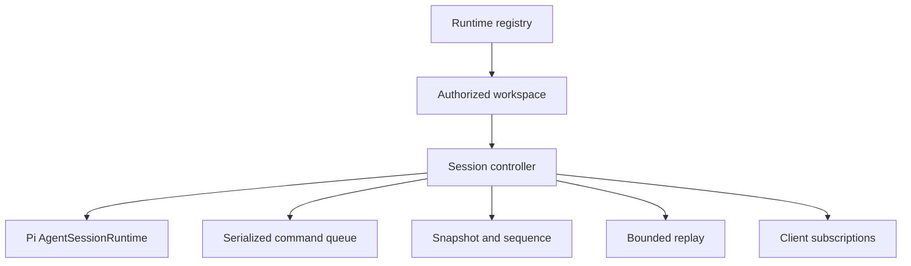
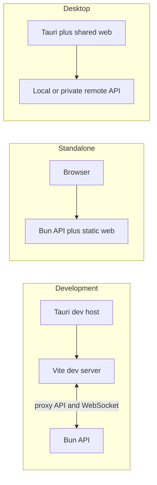

# Oh My ADE System Specification

## 1. Document control

| Field                  | Value                                                                    |
| ---------------------- | ------------------------------------------------------------------------ |
| Product                | Oh My ADE (Agentic Development Environment)                              |
| Status                 | Draft                                                                    |
| Scope                  | Whole system                                                             |
| Audience               | Product, web, desktop, API, security, and operations contributors        |
| Related specifications | [API](./api.spec.md), [Web](./web.spec.md), [Desktop](./desktop.spec.md) |

The key words **MUST**, **MUST NOT**, **SHOULD**, **SHOULD NOT**, and **MAY** are normative. Requirement identifiers are stable references; changing an identifier requires updating every document and test that cites it.

## 2. Purpose

Oh My ADE provides a graphical interface to the Pi coding agent. It operates as:

- a responsive browser application for desktop and mobile screens; and
- a Tauri desktop application with narrowly scoped native integrations.

The backend is independently executable. A browser or desktop client can connect while the backend host is running, and an accepted agent run is not owned by the client connection that started it.

## 3. Scope

### 3.1 In scope

- Agent conversations, streaming output, tool activity, approvals, and session navigation.
- Authorized workspace exploration, file viewing, diffs, and interactive terminals.
- Model, provider, resource, and application settings.
- Local-first browser and Tauri clients using one shared React application.
- Reconnection, bounded replay, snapshots, and multi-client coordination.
- Optional authenticated access to a backend on a private remote host.

### 3.2 Out of scope

- A second renderer implemented specifically for Tauri.
- Direct Pi SDK access from a client.
- Public internet hosting without a separately approved threat model and deployment design.
- Treating approval prompts, project trust, or a terminal UI as an operating-system sandbox.
- General unrestricted host filesystem or shell access from a browser or WebView.

## 4. System context

### 4.1 Component boundaries

| Component               | Responsibility                                                                             | Normative specification      |
| ----------------------- | ------------------------------------------------------------------------------------------ | ---------------------------- |
| Bun API                 | Authentication, transport, protocol validation, host access, and production static serving | [API](./api.spec.md)         |
| Effect application core | Service composition, long-lived resources, concurrency, interruption, and typed failures   | [API](./api.spec.md)         |
| Pi adapter              | Server-only Pi SDK integration and projection into application-owned values                | [API](./api.spec.md)         |
| React web application   | Shared responsive UI, client state, reconnection, and accessible interaction               | [Web](./web.spec.md)         |
| Tauri host              | Native window, credentials, lifecycle convenience, and least-privilege OS integrations     | [Desktop](./desktop.spec.md) |
| Shared protocol         | Versioned commands, resources, snapshots, events, and public errors                        | [API](./api.spec.md)         |

### 4.2 Dependency direction

Client packages MUST depend on application protocol values, not server, Effect, Bun, filesystem, or Pi SDK types.

## 5. System requirements

### 5.1 Product and deployment

| ID         | Requirement                                                                                                                   |
| ---------- | ----------------------------------------------------------------------------------------------------------------------------- |
| SYS-FR-001 | The system MUST provide the same core agent experience through desktop and mobile browsers and the Tauri desktop application. |
| SYS-FR-002 | The web and desktop applications MUST use the same React renderer build.                                                      |
| SYS-FR-003 | The API MUST run independently of Tauri and MUST remain usable when no desktop application is running.                        |
| SYS-FR-004 | The production API MUST be able to serve the compiled web application and its API from one configured origin.                 |
| SYS-FR-005 | Tauri MAY launch and monitor a local API process as a convenience, but the API lifecycle MUST remain independently operable.  |
| SYS-FR-006 | Clients MUST distinguish resources on the API host from resources on the desktop client's host.                               |

### 5.2 Agent sessions

| ID         | Requirement                                                                                                                                       |
| ---------- | ------------------------------------------------------------------------------------------------------------------------------------------------- |
| SYS-FR-010 | The system MUST support creating, opening, listing, renaming, replacing, and closing agent sessions.                                              |
| SYS-FR-011 | A session MUST support prompts, steering, follow-ups, abort, model selection, thinking controls, compaction, retry visibility, and tool activity. |
| SYS-FR-012 | An accepted agent run MUST survive browser refreshes, WebSocket interruptions, and desktop client closure.                                        |
| SYS-FR-013 | Pi MUST remain the source of truth for conversation persistence.                                                                                  |
| SYS-FR-014 | Oh My ADE MUST store only application-specific settings, trust records, and metadata outside Pi persistence.                                      |
| SYS-FR-015 | Multiple authorized clients MAY observe a session; session mutations MUST be serialized or use an explicitly specified conflict policy.           |

### 5.3 Workspace and terminal

| ID         | Requirement                                                                                                                                   |
| ---------- | --------------------------------------------------------------------------------------------------------------------------------------------- |
| SYS-FR-020 | Users MUST be able to browse an authorized workspace tree and read bounded file content.                                                      |
| SYS-FR-021 | Users MUST be able to inspect bounded file, Git, patch, and Pi tool-result diffs.                                                             |
| SYS-FR-022 | Workspace resources MUST use opaque workspace identifiers and canonical relative paths on the wire.                                           |
| SYS-FR-023 | Workspace change events MUST carry revisions that allow clients to detect missed or conflicting updates.                                      |
| SYS-FR-024 | Trusted and authorized users MAY open interactive terminal sessions owned by the API host.                                                    |
| SYS-FR-025 | Interactive terminals, Pi direct bash, and Pi tool execution MUST have separate identities, lifecycles, authorization, and protocol messages. |

### 5.4 Communication and recovery

| ID         | Requirement                                                                                                                    |
| ---------- | ------------------------------------------------------------------------------------------------------------------------------ |
| SYS-FR-030 | HTTP MUST carry bounded resource operations and initial snapshots.                                                             |
| SYS-FR-031 | WebSocket MUST carry interactive commands, streaming events, approvals, terminal I/O, and workspace changes.                   |
| SYS-FR-032 | Commands MUST carry client-generated identifiers for correlation and bounded deduplication within one server incarnation.      |
| SYS-FR-033 | Events MUST carry a protocol version, stable stream identity, and monotonically increasing sequence number within that stream. |
| SYS-FR-034 | Reconnection MUST atomically establish live subscription with either complete replay or a snapshot and replay position.        |
| SYS-FR-035 | A changed server incarnation or controller identity MUST force a fresh snapshot.                                               |
| SYS-FR-036 | A client MUST NOT automatically retry a mutation whose outcome is ambiguous across a server restart.                           |

## 6. Runtime model

Each controller has a stable Oh My ADE controller identifier and a replaceable Pi session identity. It owns its Pi resource, queue, snapshot, sequence counter, replay buffer, publication channel, and supervised work. Disconnecting a client removes only its subscription. Explicit session closure, unrecoverable failure, eviction, or server shutdown closes the controller and runs all finalizers.

## 7. Quality requirements

### 7.1 Security and privacy

| ID          | Requirement                                                                                                                                           |
| ----------- | ----------------------------------------------------------------------------------------------------------------------------------------------------- |
| SYS-SEC-001 | The API MUST bind to `127.0.0.1` by default and MUST require explicit configuration for non-loopback binding.                                         |
| SYS-SEC-002 | Every HTTP and WebSocket operation MUST be authenticated and authorized for its workspace, session, terminal, or setting.                             |
| SYS-SEC-003 | Browser traffic MUST validate Origin; cookie-authenticated mutations MUST use CSRF protection; long-lived bearer credentials MUST NOT appear in URLs. |
| SYS-SEC-004 | TLS MUST be used whenever traffic can leave loopback. Private networking or a VPN SHOULD be preferred to public exposure.                             |
| SYS-SEC-005 | Workspace paths MUST be canonicalized and constrained to configured allowed roots.                                                                    |
| SYS-SEC-006 | Model credentials and server secrets MUST remain outside browser and Tauri WebView processes.                                                         |
| SYS-SEC-007 | Unattended tool approvals MUST default to deny.                                                                                                       |
| SYS-SEC-008 | Tauri commands and plugins MUST use least-privilege, window-scoped capabilities and a restrictive production content security policy.                 |
| SYS-SEC-009 | Logs MUST omit prompt content, model output, credentials, tool arguments, and unrestricted paths by default.                                          |

### 7.2 Reliability and performance

| ID          | Requirement                                                                                                                                                     |
| ----------- | --------------------------------------------------------------------------------------------------------------------------------------------------------------- |
| SYS-NFR-001 | Every long-lived agent, terminal, watcher, and subscription resource MUST have an explicit owner and deterministic cleanup path.                                |
| SYS-NFR-002 | Slow or disconnected clients MUST NOT indefinitely backpressure agent execution or terminal output.                                                             |
| SYS-NFR-003 | HTTP bodies, WebSocket messages, attachments, trees, files, diffs, queues, replay buffers, terminals, and concurrent controllers MUST have configurable bounds. |
| SYS-NFR-004 | Separate sessions SHOULD execute concurrently; mutations within one session MUST preserve defined ordering.                                                     |
| SYS-NFR-005 | Process shutdown MUST stop new intake, perform a bounded drain, close dynamic resources, flush durable settings, and then exit.                                 |
| SYS-NFR-006 | The browser UI MUST remain functional at supported mobile and desktop viewport sizes and meet the accessibility requirements in the web specification.          |

## 8. Deployment profiles

| Profile        | Required behavior                                                                                    |
| -------------- | ---------------------------------------------------------------------------------------------------- |
| Development    | Vite serves the renderer and proxies API/WebSocket traffic to the Bun API; Tauri loads Vite.         |
| Standalone web | Bun serves both the compiled renderer and API; the host remains running for Pi and workspace access. |
| Desktop        | Tauri connects to a configured local or private remote API and MAY manage a local sidecar process.   |

## 9. Verification

The release test suite MUST cover:

- protocol schema round trips and incompatible-version handling;
- an accepted agent run surviving client disconnect and reconnect;
- complete replay and snapshot fallback without an event gap;
- command deduplication within a server incarnation and ambiguity after restart;
- workspace containment, symlink escape prevention, and stale revision handling;
- bounded large tree, file, diff, attachment, queue, and terminal behavior;
- terminal environment filtering and cleanup;
- authentication, authorization, Origin, CSRF, TLS configuration, and remote-bind safeguards;
- process shutdown with active sessions, terminals, watchers, and clients; and
- production builds of web, API, and supported desktop targets.

## 10. System acceptance criteria

The system specification is satisfied when:

1. `SYS-FR-*`, `SYS-SEC-*`, and `SYS-NFR-*` requirements are implemented or explicitly deferred with an owner and rationale.
2. The API, web, and desktop specifications trace their detailed requirements back to this document.
3. No Pi, Effect, Bun, filesystem, provider, or unrestricted host-path type crosses the public client protocol.
4. Web and desktop use one renderer while the API remains independently executable.
5. Reconnection, session ownership, authorization, bounded resources, and shutdown behavior pass their integration tests.

## 11. Open decisions

- Supported browser and desktop operating-system version matrix.
- Authentication and pairing mechanism for the first remote-access release.
- Default operational limits for local, private single-user, and future multi-user profiles.
- Distribution and update strategy for the independently executable API sidecar.
