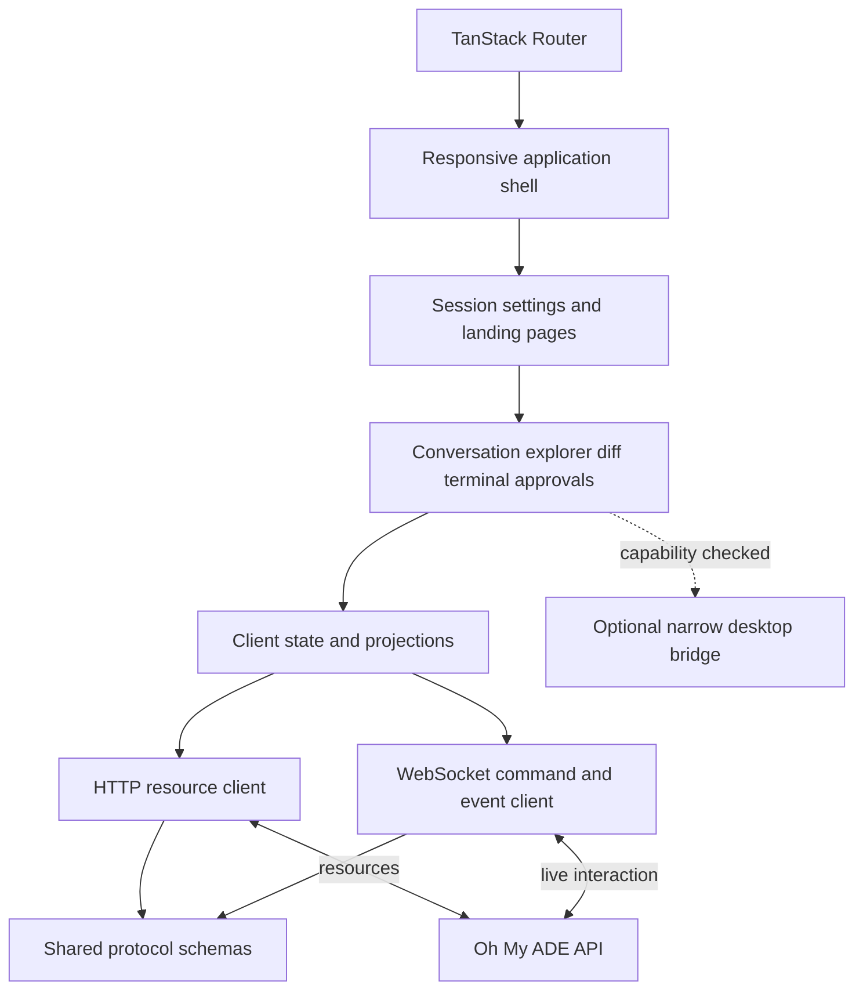
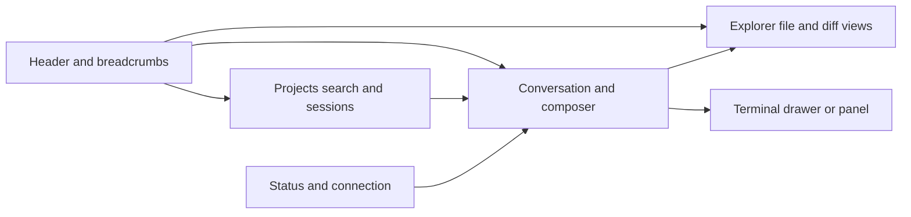
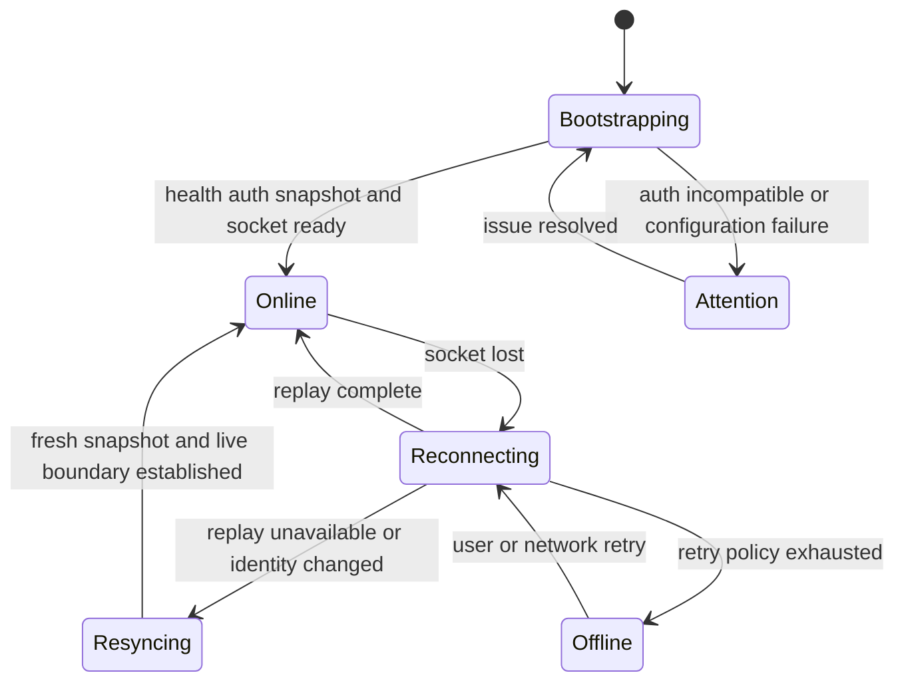

# Oh My ADE Web Specification

## 1. Document control

| Field                | Value                                                        |
| -------------------- | ------------------------------------------------------------ |
| Product              | Oh My ADE                                                    |
| Status               | Proposed; scaffold exists and product integration is pending |
| Scope                | Shared React renderer for browsers and Tauri                 |
| Parent specification | [System](./system.spec.md)                                   |
| Peer specifications  | [API](./api.spec.md), [Desktop](./desktop.spec.md)           |

The key words **MUST**, **MUST NOT**, **SHOULD**, **SHOULD NOT**, and **MAY** are normative. Web requirements use the `WEB-FR`, `WEB-SEC`, and `WEB-NFR` prefixes. They refine `SYS-FR-001`, `SYS-FR-002`, `SYS-FR-006`, `SYS-FR-010` through `SYS-FR-036`, `SYS-SEC-002` through `SYS-SEC-009`, and `SYS-NFR-002`, `SYS-NFR-003`, and `SYS-NFR-006`.

## 2. Purpose

The web application is the single responsive user interface for Oh My ADE. It runs in desktop and mobile browsers and is embedded unchanged by the Tauri host. It presents agent sessions, workspace resources, diffs, terminals, approvals, settings, and connection recovery without importing Pi or server implementation types.

## 3. Scope

### 3.1 In scope

- Responsive application shell, navigation, routing, panels, themes, and settings.
- Session transcript, live agent output, tool activity, approvals, and prompt composition.
- Workspace tree, file and diff views, and interactive terminal presentation.
- HTTP resource loading, WebSocket commands/events, client-side projections, and recovery.
- Accessibility, keyboard interaction, mobile adaptations, safe rendering, and bounded client state.
- The renderer used by both browsers and Tauri.

### 3.2 Out of scope

- Pi SDK integration, agent orchestration, host filesystem operations, PTY creation, or credentials.
- Native windows, menus, tray, keychain, notifications, or sidecar management.
- A separate Tauri-only renderer.
- Client-side authority over session persistence, workspace revisions, terminal lifetime, or approval policy.
- Editing generated shadcn/ui primitive files or the shadcn configuration as part of feature work.

## 4. Architecture

### 4.1 Client structure

### 4.2 Dependency rules

| Boundary           | Rule                                                                                                                                           |
| ------------------ | ---------------------------------------------------------------------------------------------------------------------------------------------- |
| Routes             | Route modules SHOULD select page components and decode route/search state; feature behavior belongs below the route layer.                     |
| Feature components | Composite application components MAY use shadcn/ui primitives but MUST NOT modify generated files under `apps/web/src/components/shadcn`.      |
| Protocol           | API data MUST enter through runtime-validated protocol schemas and client-owned projections.                                                   |
| Server separation  | The web application MUST NOT import Pi, Effect application services, Bun server modules, Rust, filesystem objects, or unrestricted host paths. |
| Desktop separation | Native actions MUST be exposed through a small capability-checked adapter; ordinary web operation MUST not require Tauri globals.              |
| Imports            | New cross-directory imports MUST use configured route aliases rather than relative traversal.                                                  |

## 5. Current implementation baseline

The repository currently contains a React 19 and Vite scaffold with TanStack Router, shadcn/ui composites, Tailwind CSS, Lexical, and resizable panels. The following routes exist:

| Route       | Current state                             | Target responsibility                                                                        |
| ----------- | ----------------------------------------- | -------------------------------------------------------------------------------------------- |
| `/`         | Placeholder landing route                 | Entry, connection setup, or redirect to the most relevant session                            |
| `/$session` | Demonstration transcript and panel layout | Fully connected agent workspace                                                              |
| `/settings` | Placeholder                               | Connection, appearance, model/provider, workspace, security, and desktop-capability settings |

The current session list is fixture data; transcript content is static; the composer is plain text without submission controls; workspace views and terminal are placeholders; and no API/protocol client exists. These are scaffolding, not accepted product behavior.

## 6. Information architecture and layout

### 6.1 Desktop workspace

The desktop layout MAY present sidebar, session, views, and terminal simultaneously using resizable panels. Panel sizes and visibility SHOULD persist locally per viewport class. The conversation remains the primary region.

### 6.2 Mobile workspace

On narrow screens, the application MUST not shrink the full desktop panel matrix into an unusable layout. It MUST present one primary surface at a time, retain an obvious route back to the session, and expose projects, files, diffs, terminal, and settings through navigation appropriate to touch devices. Composer controls and approval actions MUST remain reachable above the virtual keyboard and safe areas.

### 6.3 Routes and URL state

| ID         | Requirement                                                                                                                                                             |
| ---------- | ----------------------------------------------------------------------------------------------------------------------------------------------------------------------- |
| WEB-FR-001 | A session MUST have a stable URL using the Oh My ADE controller/session route identity defined by the protocol.                                                         |
| WEB-FR-002 | Refreshing a session URL MUST reload an authoritative snapshot and recover its live subscription when authorized.                                                       |
| WEB-FR-003 | File, diff, or settings selection that users reasonably expect to share or restore SHOULD be represented in path or validated search state.                             |
| WEB-FR-004 | Unknown, unavailable, forbidden, and incompatible resources MUST render distinct recovery states.                                                                       |
| WEB-FR-005 | The renderer MUST preserve browser back/forward semantics and MUST NOT use native desktop navigation as a requirement.                                                  |
| WEB-FR-006 | When hosted by Tauri without native decorations, the header MUST provide accessible window controls and a draggable region; browser rendering MUST omit those controls. |

## 7. Functional requirements

### 7.1 Connection and bootstrap

| ID         | Requirement                                                                                                                                                 |
| ---------- | ----------------------------------------------------------------------------------------------------------------------------------------------------------- |
| WEB-FR-010 | The application MUST determine its API endpoint from trusted runtime/build configuration or a validated user setting.                                       |
| WEB-FR-011 | Bootstrap MUST load health/protocol compatibility, authentication state, user settings, workspaces, sessions, and the selected resource snapshot as needed. |
| WEB-FR-012 | The UI MUST distinguish connecting, online, degraded, reconnecting, authentication-required, incompatible, and offline states.                              |
| WEB-FR-013 | Loss of the WebSocket MUST NOT discard the current authoritative snapshot or imply that the agent run stopped.                                              |
| WEB-FR-014 | Resource requests and route transitions MUST be cancellable or supersedable to avoid stale updates.                                                         |

### 7.2 Projects and sessions

| ID         | Requirement                                                                                                                                    |
| ---------- | ---------------------------------------------------------------------------------------------------------------------------------------------- |
| WEB-FR-020 | Users MUST be able to list/search sessions, filter by project/workspace, create a session, open it, rename it, and close it when authorized.   |
| WEB-FR-021 | Session list items SHOULD show project, title, activity, run state, and unread/attention state without leaking unrestricted host paths.        |
| WEB-FR-022 | Session navigation MUST keep stable identity across a successful Pi runtime replacement and update public Pi identity from `session_replaced`. |
| WEB-FR-023 | Destructive or state-replacing session operations MUST communicate scope and require confirmation where accidental activation would lose work. |
| WEB-FR-024 | Concurrent-client conflicts MUST be rendered from protocol errors or revisions; the UI MUST not silently overwrite authoritative state.        |

### 7.3 Conversation transcript

| ID         | Requirement                                                                                                                                          |
| ---------- | ---------------------------------------------------------------------------------------------------------------------------------------------------- |
| WEB-FR-030 | The transcript MUST render user, assistant, tool, custom, lifecycle, diagnostic, attachment, and approval entries from protocol-owned values.        |
| WEB-FR-031 | Streaming text, thinking, and tool-call deltas MUST update the correct message/content index and reconcile to authoritative final messages.          |
| WEB-FR-032 | The transcript MUST expose run, retry, compaction, queue, tool, and error states without relying on color alone.                                     |
| WEB-FR-033 | The user MUST be able to follow live output while retaining manual scroll position; automatic scroll MUST not pull a user away from older content.   |
| WEB-FR-034 | Large tool results and long messages MUST use progressive disclosure or virtualization and MUST not block the main interaction path.                 |
| WEB-FR-035 | Markdown, code, links, images, and tool output MUST be rendered with an explicit safe-content policy. Unsanitized model HTML MUST never be injected. |
| WEB-FR-036 | A sequence gap or projection failure MUST show recovery state and request replay or a fresh snapshot.                                                |

### 7.4 Composer and run controls

| ID         | Requirement                                                                                                                                                      |
| ---------- | ---------------------------------------------------------------------------------------------------------------------------------------------------------------- |
| WEB-FR-040 | The composer MUST support multiline text, submit, abort, steering/follow-up mode, attachments, and disabled/loading/error states.                                |
| WEB-FR-041 | The composer MUST preserve a recoverable draft across route changes, reconnects, and recoverable submission failures.                                            |
| WEB-FR-042 | Submission MUST allocate a unique command ID and MUST show pending, accepted, rejected, or ambiguous outcome separately from run completion.                     |
| WEB-FR-043 | The UI MUST NOT automatically resubmit an ambiguous mutation after a server-incarnation change.                                                                  |
| WEB-FR-044 | Model and thinking controls MUST show only capabilities reported by the selected session/model and MUST display the effective clamped value returned by the API. |
| WEB-FR-045 | Queued steering/follow-up content MUST be visible and clearable, with restored text returned to the composer when supported.                                     |
| WEB-FR-046 | Keyboard submission MUST be configurable or clearly documented and MUST preserve an accessible way to insert new lines.                                          |

### 7.5 Approvals and extension interactions

| ID         | Requirement                                                                                                                     |
| ---------- | ------------------------------------------------------------------------------------------------------------------------------- |
| WEB-FR-050 | Approval requests MUST show the requesting session, tool/operation, safe argument summary, scope, expiry, and consequences.     |
| WEB-FR-051 | Approval actions MUST be correlated, single-use, and unavailable after resolution, abort, expiry, or authorization loss.        |
| WEB-FR-052 | Allow-once and deny MUST be distinct; persistent allow MUST appear only when server policy explicitly supports it.              |
| WEB-FR-053 | Supported extension select, confirm, input, and editor requests MUST be accessible and cancellable with Pi-compatible defaults. |
| WEB-FR-054 | The UI MUST state that approvals and project trust are policy controls, not sandbox guarantees.                                 |

### 7.6 Workspace explorer and diffs

| ID         | Requirement                                                                                                                          |
| ---------- | ------------------------------------------------------------------------------------------------------------------------------------ |
| WEB-FR-060 | The explorer MUST render protocol tree snapshots and changes with `@pierre/trees/react` once the dependency is introduced.           |
| WEB-FR-061 | The explorer MUST preserve expansion/selection where possible and request a resnapshot on revision gaps or conflicts.                |
| WEB-FR-062 | File views MUST communicate loading, missing, forbidden, binary, too-large, and truncated states.                                    |
| WEB-FR-063 | File, Git, patch, and Pi tool-result diffs MUST render through `@pierre/diffs/react` from protocol-owned inputs.                     |
| WEB-FR-064 | Diff views MUST expose source, path, revisions, truncation, and binary state and MUST support responsive split/stacked presentation. |
| WEB-FR-065 | Pierre-specific types MUST remain inside web adapters and MUST NOT escape into shared protocol or server packages.                   |
| WEB-FR-066 | Filesystem mutation and diff accept/reject controls MUST remain absent until the API specifies authorized revision-checked commands. |

### 7.7 Interactive terminal

| ID         | Requirement                                                                                                                    |
| ---------- | ------------------------------------------------------------------------------------------------------------------------------ |
| WEB-FR-070 | The terminal view MUST use an opaque terminal identity and protocol commands/events; it MUST NOT invoke a local browser shell. |
| WEB-FR-071 | The view MUST support open, input, resize, signal, close, ordered output, exit, replay, and overflow/reset.                    |
| WEB-FR-072 | Terminal dimensions MUST follow its rendered size and update after panel or viewport changes.                                  |
| WEB-FR-073 | Disconnect/reconnect MUST communicate whether output was completely replayed or a gap requires reset.                          |
| WEB-FR-074 | Opening a terminal MUST present the server-host workspace and direct host-execution risk, especially for remote endpoints.     |
| WEB-FR-075 | Terminal focus and keyboard capture MUST be explicit and MUST not trap users from application navigation.                      |

### 7.8 Settings and theme

| ID         | Requirement                                                                                                                                        |
| ---------- | -------------------------------------------------------------------------------------------------------------------------------------------------- |
| WEB-FR-080 | Settings MUST separate local presentation preferences from API-owned model, provider, workspace, trust, and security settings.                     |
| WEB-FR-081 | Credential secrets MUST be entered only through an approved secure API or desktop flow and MUST never be read back into general client state.      |
| WEB-FR-082 | Theme selection MUST support light, dark, and system behavior and apply before or during initial render without a prolonged incorrect-theme flash. |
| WEB-FR-083 | Settings writes MUST expose saving, durable success, validation failure, and persistence failure.                                                  |
| WEB-FR-084 | Desktop-only settings MUST be capability-gated and hidden or explained in ordinary browsers.                                                       |

## 8. Client state and recovery

Client state MUST distinguish:

- server-authoritative snapshots and sequenced events;
- local ephemeral UI state such as panel visibility and drafts;
- pending command correlation state;
- optimistic state, used only where the protocol defines reconciliation; and
- cached resource data, which MUST be invalidated by identity or revision changes.

Snapshots MUST be applied before subsequent live events. Duplicate or old sequences MUST be ignored safely; a forward gap MUST trigger recovery. Route changes and reconnects MUST not leak obsolete subscriptions.

## 9. Security and privacy requirements

| ID          | Requirement                                                                                                                                                                   |
| ----------- | ----------------------------------------------------------------------------------------------------------------------------------------------------------------------------- |
| WEB-SEC-001 | The client MUST send credentials only to the configured trusted API origin and MUST not place long-lived credentials in URLs, logs, local drafts, or analytics.               |
| WEB-SEC-002 | Cookie-authenticated mutations MUST include the API-issued CSRF token; WebSocket connection MUST use the approved cookie or single-use-ticket flow.                           |
| WEB-SEC-003 | Model and tool output MUST be treated as untrusted content; links, Markdown, syntax highlighting, images, and copied commands MUST follow a documented safe-rendering policy. |
| WEB-SEC-004 | The browser MUST NOT receive or reconstruct unrestricted server-host paths or environment values.                                                                             |
| WEB-SEC-005 | The renderer MUST NOT expose generic Tauri invoke, shell, filesystem, or plugin access.                                                                                       |
| WEB-SEC-006 | Sensitive fields MUST prevent accidental persistence and SHOULD offer paste/reveal behavior appropriate to credentials.                                                       |
| WEB-SEC-007 | Security-relevant endpoint, trust, approval, and terminal states MUST be visible and not communicated only by color or transient notification.                                |

## 10. Quality requirements

### 10.1 Accessibility

| ID          | Requirement                                                                                                                    |
| ----------- | ------------------------------------------------------------------------------------------------------------------------------ |
| WEB-NFR-001 | Core workflows MUST meet WCAG 2.2 AA expectations for semantics, contrast, focus, labels, keyboard operation, and target size. |
| WEB-NFR-002 | Streaming updates MUST use restrained live-region announcements and MUST not repeatedly interrupt assistive technology.        |
| WEB-NFR-003 | Resizable panels, dialogs, questionnaires, menus, trees, diffs, and terminal escape paths MUST be keyboard operable.           |
| WEB-NFR-004 | Reduced-motion and system color preferences MUST be respected.                                                                 |

### 10.2 Responsiveness and performance

| ID          | Requirement                                                                                                                                                |
| ----------- | ---------------------------------------------------------------------------------------------------------------------------------------------------------- |
| WEB-NFR-010 | Supported mobile and desktop viewports MUST complete every core workflow without horizontal page overflow.                                                 |
| WEB-NFR-011 | Long transcripts, trees, files, diffs, and terminal buffers MUST use bounded rendering, virtualization, workers, or progressive disclosure as appropriate. |
| WEB-NFR-012 | Token streaming SHOULD render at a cadence that preserves responsiveness rather than forcing one React commit per token callback.                          |
| WEB-NFR-013 | Client-side queues, caches, replay application, object URLs, workers, observers, and subscriptions MUST have cleanup and bounds.                           |
| WEB-NFR-014 | The protocol schema choice MUST be checked against the production browser bundle before adoption.                                                          |

### 10.3 Compatibility and resilience

| ID          | Requirement                                                                                                     |
| ----------- | --------------------------------------------------------------------------------------------------------------- |
| WEB-NFR-020 | The application MUST fail explicitly on unsupported protocol versions and SHOULD provide upgrade guidance.      |
| WEB-NFR-021 | React error boundaries MUST isolate recoverable feature failures and preserve a route to diagnostics or reload. |
| WEB-NFR-022 | Web-only core workflows MUST run without Tauri APIs present.                                                    |
| WEB-NFR-023 | Browser support and mobile device coverage MUST be defined before the first production release.                 |

## 11. Verification

### 11.1 Component and state tests

- Transcript projection, delta reconciliation, tool states, scrolling, and large-content disclosure.
- Composer draft, command IDs, pending/accepted/rejected/ambiguous outcomes, queues, model, and thinking controls.
- Approval and extension interaction correlation, timeout, abort, and accessibility.
- Tree revisions, file states, diff adapters, terminal ordering/replay, and settings durability states.
- Connection state transitions, duplicate sequences, gaps, identity changes, and subscription cleanup.

### 11.2 Route and integration tests

- Direct session URL load, refresh, back/forward navigation, invalid resource, forbidden state, and replacement identity.
- HTTP bootstrap and WebSocket replay/snapshot recovery against a protocol test server.
- Authentication, CSRF, ticket, endpoint switching, and incompatible protocol behavior.
- Desktop capability adapter present and absent.

### 11.3 Visual, responsive, and accessibility tests

Test at defined mobile, tablet, laptop, and large desktop viewports, including virtual keyboard and safe-area behavior. Automated checks MUST be supplemented by keyboard-only, screen-reader smoke, focus-order, reduced-motion, high-zoom, long-content, and slow-network scenarios.

## 12. Delivery sequence

This section is informative.

1. Introduce the shared protocol client, endpoint configuration, bootstrap, authentication state, and connection status.
2. Replace session fixtures with resources and implement sequenced snapshot/event state.
3. Complete transcript projection, composer controls, prompt lifecycle, run controls, and approvals.
4. Add project/session management, model/thinking controls, and settings.
5. Add Pierre-backed explorer/file/diff views and a protocol-backed terminal.
6. Complete mobile navigation, accessibility, performance bounds, reconnection UX, and desktop capability integration.

## 13. Acceptance criteria

The web specification is satisfied when:

1. The same production renderer works in supported browsers and the Tauri WebView without requiring native APIs for core workflows.
2. All fixture content and placeholder panels in core routes are replaced by protocol-backed states.
3. Session commands, events, revisions, replay, snapshot recovery, and ambiguous outcomes follow the API specification.
4. Agent output and native capability access meet the safe-rendering and least-privilege rules.
5. Core workflows pass component, integration, responsive, keyboard, accessibility, typecheck, lint, format, and production-build checks.

## 14. Open decisions

- Supported browser, mobile device, and viewport matrix.
- Terminal rendering library and accessibility fallback.
- Markdown/code rendering pipeline and sanitization policy.
- Transcript, tree, and diff virtualization thresholds.
- Mobile navigation pattern and persistence rules for panel state.
- Local draft storage policy and retention.
